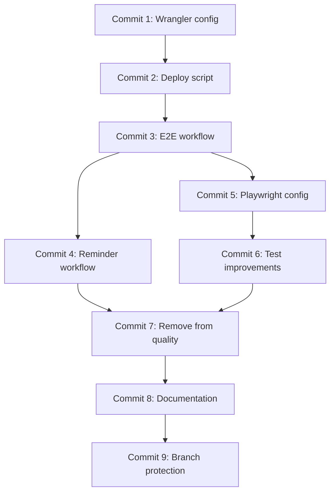

# Plan de Commits Atomiques - E2E Preview Deployments

**Issue**: [#35 - Optimize OpenNext/Cloudflare startup time in CI](https://github.com/sebc-dev/website/issues/35)
**Document d'implémentation**: [e2e-preview-deployments-implementation.md](./e2e-preview-deployments-implementation.md)
**ADR**: [001 - Use Preview Deployments for E2E Tests in CI](../decisions/001-e2e-tests-preview-deployments.md)

## Vue d'ensemble

Ce document organise l'implémentation des tests E2E via preview deployments en **commits atomiques** pour faciliter la code review et permettre une intégration progressive.

### Principes des commits atomiques

- **Un commit = Une fonctionnalité testable**
- **Commits indépendants** autant que possible
- **Ordre logique** : infrastructure → configuration → automatisation
- **Chaque commit peut être reviewé isolément**
- **Rollback facile** en cas de problème

### Stratégie de déploiement

```
Phase 1: Configuration de base
  ├─ Commit 1: Configuration wrangler.jsonc
  └─ Commit 2: Script de déploiement preview

Phase 2: Workflows GitHub Actions
  ├─ Commit 3: Workflow E2E principal (commentaire @e2e)
  └─ Commit 4: Workflow E2E reminder (PRs vers main)

Phase 3: Configuration Playwright
  ├─ Commit 5: Mise à jour playwright.config.ts
  └─ Commit 6: Amélioration des tests E2E

Phase 4: Intégration et documentation
  ├─ Commit 7: Retrait E2E de quality.yml
  ├─ Commit 8: PR template et docs
  └─ Commit 9: Protection de branche main
```

---

## Phase 1: Configuration de base

### Commit 1: 🔧 Configure Wrangler for preview environments

**Objectif** : Ajouter la configuration des environments preview dans `wrangler.jsonc`

**Fichiers modifiés** :
- `wrangler.jsonc`

**Changements** :

```jsonc
// Ajouter dans wrangler.jsonc
{
  // ... config existante
  "compatibility_date": "2024-09-23",  // Mise à jour si < 2024-09-23
  "compatibility_flags": ["nodejs_compat"],  // Ajouter si absent

  "env": {
    "production": {
      "name": "website-production",
      "routes": [
        {
          "pattern": "sebc.dev",
          "zone_name": "sebc.dev"
        }
      ]
    },
    "preview": {
      "name": "website-preview-*",
      "routes": []
    }
  }
}
```

**Message de commit** :
```
🔧 config(wrangler): add preview environment configuration

- Add preview environment config to wrangler.jsonc
- Update compatibility_date to 2024-09-23 (required for OpenNext)
- Ensure nodejs_compat flag is present
- Preview deployments will use website-preview-* naming pattern
- No routes configured for previews (uses workers.dev subdomain)

Related to #35
```

**Tests de validation** :
```bash
# Vérifier la syntaxe JSON
pnpm wrangler config validate

# Vérifier que la config peut être lue
pnpm wrangler whoami
```

**Checklist** :
- [ ] `compatibility_date` >= "2024-09-23"
- [ ] `compatibility_flags` contient `nodejs_compat`
- [ ] Environment `preview` configuré
- [ ] Naming pattern `website-preview-*` défini
- [ ] Config validée avec `wrangler config validate`

---

### Commit 2: 📦 Add preview deployment script

**Objectif** : Créer le script de déploiement preview + configuration package.json

**Fichiers créés/modifiés** :
- `scripts/deploy-preview.sh` (nouveau)
- `package.json` (modification)

**Changements** :

1. **Créer `scripts/deploy-preview.sh`** :
```bash
#!/bin/bash
set -e

# Get PR number or branch name
PR_NUMBER=${GITHUB_PR_NUMBER:-$(git rev-parse --abbrev-ref HEAD | sed 's/[^a-zA-Z0-9-]/-/g')}
DEPLOYMENT_NAME="website-preview-${PR_NUMBER}"

echo "Deploying preview environment: ${DEPLOYMENT_NAME}"

# Build the application with OpenNext
echo "Building Next.js app with OpenNext..."
pnpm run deploy:build

# Deploy to Cloudflare Workers
echo "Deploying to Cloudflare Workers..."
pnpm wrangler deploy \
  --env preview \
  --name "${DEPLOYMENT_NAME}"

# Get deployment URL (format: <name>.<subdomain>.workers.dev)
SUBDOMAIN=$(pnpm wrangler whoami | grep -oP 'workers\.dev subdomain:\s+\K\S+' || echo "")
if [ -z "$SUBDOMAIN" ]; then
  # Fallback: try to extract from account info
  SUBDOMAIN=$(pnpm wrangler whoami 2>&1 | grep -oP '(?<=subdomain: )\S+' || echo "unknown")
fi

DEPLOYMENT_URL="https://${DEPLOYMENT_NAME}.${SUBDOMAIN}.workers.dev"

echo "Deployment URL: ${DEPLOYMENT_URL}"
echo "DEPLOYMENT_URL=${DEPLOYMENT_URL}" >> $GITHUB_OUTPUT
echo "DEPLOYMENT_NAME=${DEPLOYMENT_NAME}" >> $GITHUB_OUTPUT
```

2. **Ajouter dans `package.json`** :
```json
{
  "scripts": {
    "deploy:build": "opennextjs-cloudflare build"
  }
}
```

3. **Rendre le script exécutable** :
```bash
chmod +x scripts/deploy-preview.sh
```

**Message de commit** :
```
📦 feat(deploy): add preview deployment script

- Create scripts/deploy-preview.sh for automated preview deployments
- Script generates unique deployment name per PR
- Uses OpenNext build process via deploy:build script
- Extracts and outputs deployment URL for GitHub Actions
- Add deploy:build script to package.json

The script can be used both locally and in CI environments.

Related to #35
```

**Tests de validation** :
```bash
# Vérifier que le script est exécutable
test -x scripts/deploy-preview.sh && echo "✓ Script is executable"

# Vérifier la syntaxe du script
bash -n scripts/deploy-preview.sh && echo "✓ Script syntax is valid"

# Vérifier que deploy:build existe
pnpm run deploy:build --help 2>&1 | grep -q "opennextjs" && echo "✓ deploy:build configured"

# Test local (si credentials configurés)
# GITHUB_PR_NUMBER=test ./scripts/deploy-preview.sh
```

**Checklist** :
- [ ] Script `deploy-preview.sh` créé
- [ ] Script est exécutable (`chmod +x`)
- [ ] Syntaxe bash validée
- [ ] Script `deploy:build` ajouté à package.json
- [ ] Variables d'environnement documentées (GITHUB_PR_NUMBER, GITHUB_OUTPUT)

---

## Phase 2: Workflows GitHub Actions

### Commit 3: 🤖 Add E2E workflow with comment trigger

**Objectif** : Créer le workflow principal déclenché par commentaire `@e2e`

**Fichiers créés** :
- `.github/workflows/e2e.yml`

**Changements** :

```yaml
name: E2E Tests (Preview Deployment)

on:
  issue_comment:
    types: [created]
  workflow_dispatch:
    inputs:
      pr_number:
        description: 'PR number to test'
        required: true
        type: string

env:
  PNPM_VERSION: 9.15.0
  NODE_VERSION: 20

jobs:
  # Check if comment triggers E2E tests
  check-trigger:
    name: Check E2E Trigger
    runs-on: ubuntu-latest
    if: |
      github.event_name == 'issue_comment' &&
      github.event.issue.pull_request &&
      (contains(github.event.comment.body, '@e2e') || contains(github.event.comment.body, '@e2e-test'))
    outputs:
      should_run: ${{ steps.check.outputs.should_run }}
      pr_number: ${{ steps.check.outputs.pr_number }}

    steps:
      - name: Check if should run
        id: check
        run: |
          echo "should_run=true" >> $GITHUB_OUTPUT
          echo "pr_number=${{ github.event.issue.number }}" >> $GITHUB_OUTPUT

      - name: Add reaction to comment
        uses: actions/github-script@v7
        with:
          script: |
            github.rest.reactions.createForIssueComment({
              owner: context.repo.owner,
              repo: context.repo.repo,
              comment_id: context.payload.comment.id,
              content: 'rocket'
            });

  e2e-preview:
    name: E2E Tests on Preview Deployment
    needs: [check-trigger]
    if: |
      always() &&
      (needs.check-trigger.outputs.should_run == 'true' || github.event_name == 'workflow_dispatch')
    runs-on: ubuntu-latest
    timeout-minutes: 15

    permissions:
      contents: read
      pull-requests: write
      statuses: write  # For status checks

    steps:
      - name: Get PR details
        id: pr
        uses: actions/github-script@v7
        with:
          script: |
            const prNumber = context.payload.issue?.number || '${{ github.event.inputs.pr_number }}';
            const { data: pr } = await github.rest.pulls.get({
              owner: context.repo.owner,
              repo: context.repo.repo,
              pull_number: prNumber
            });
            core.setOutput('ref', pr.head.ref);
            core.setOutput('sha', pr.head.sha);
            core.setOutput('number', prNumber);

      - name: Checkout PR code
        uses: actions/checkout@v4
        with:
          ref: ${{ steps.pr.outputs.ref }}

      - name: Create status check (pending)
        uses: actions/github-script@v7
        with:
          script: |
            await github.rest.repos.createCommitStatus({
              owner: context.repo.owner,
              repo: context.repo.repo,
              sha: '${{ steps.pr.outputs.sha }}',
              state: 'pending',
              target_url: '${{ github.server_url }}/${{ github.repository }}/actions/runs/${{ github.run_id }}',
              description: 'E2E tests running on preview deployment',
              context: 'e2e/preview-deployment'
            });

      - name: Setup pnpm
        uses: pnpm/action-setup@v4
        with:
          version: ${{ env.PNPM_VERSION }}

      - name: Setup Node.js
        uses: actions/setup-node@v4
        with:
          node-version: ${{ env.NODE_VERSION }}
          cache: 'pnpm'

      - name: Install dependencies
        run: pnpm install --frozen-lockfile

      - name: Setup Cloudflare credentials
        run: |
          echo "${{ secrets.CLOUDFLARE_API_TOKEN }}" > ~/.wrangler/config.toml

      - name: Deploy preview environment
        id: deploy
        env:
          CLOUDFLARE_API_TOKEN: ${{ secrets.CLOUDFLARE_API_TOKEN }}
          CLOUDFLARE_ACCOUNT_ID: ${{ secrets.CLOUDFLARE_ACCOUNT_ID }}
          GITHUB_PR_NUMBER: ${{ steps.pr.outputs.number }}
        run: ./scripts/deploy-preview.sh

      - name: Wait for deployment to be ready
        run: |
          DEPLOYMENT_URL="${{ steps.deploy.outputs.DEPLOYMENT_URL }}"
          echo "Waiting for ${DEPLOYMENT_URL} to respond..."

          # Wait up to 60 seconds for deployment to be ready
          for i in {1..12}; do
            if curl -sf "${DEPLOYMENT_URL}" > /dev/null; then
              echo "Deployment is ready!"
              exit 0
            fi
            echo "Waiting... (attempt $i/12)"
            sleep 5
          done

          echo "Deployment failed to become ready"
          exit 1

      - name: Install Playwright browsers
        run: pnpm exec playwright install chromium --with-deps

      - name: Run E2E tests
        env:
          PLAYWRIGHT_BASE_URL: ${{ steps.deploy.outputs.DEPLOYMENT_URL }}
        run: pnpm test:e2e

      - name: Upload test results
        if: always()
        uses: actions/upload-artifact@v4
        with:
          name: playwright-report
          path: playwright-report/
          retention-days: 7

      - name: Cleanup preview deployment
        if: always()
        env:
          CLOUDFLARE_API_TOKEN: ${{ secrets.CLOUDFLARE_API_TOKEN }}
          CLOUDFLARE_ACCOUNT_ID: ${{ secrets.CLOUDFLARE_ACCOUNT_ID }}
        run: |
          DEPLOYMENT_NAME="${{ steps.deploy.outputs.DEPLOYMENT_NAME }}"
          echo "Cleaning up deployment: ${DEPLOYMENT_NAME}"
          pnpm wrangler delete --name "${DEPLOYMENT_NAME}" --env preview || true

      - name: Update status check (success)
        if: success()
        uses: actions/github-script@v7
        with:
          script: |
            await github.rest.repos.createCommitStatus({
              owner: context.repo.owner,
              repo: context.repo.repo,
              sha: '${{ steps.pr.outputs.sha }}',
              state: 'success',
              target_url: '${{ github.server_url }}/${{ github.repository }}/actions/runs/${{ github.run_id }}',
              description: 'E2E tests passed ✅',
              context: 'e2e/preview-deployment'
            });

      - name: Update status check (failure)
        if: failure()
        uses: actions/github-script@v7
        with:
          script: |
            await github.rest.repos.createCommitStatus({
              owner: context.repo.owner,
              repo: context.repo.repo,
              sha: '${{ steps.pr.outputs.sha }}',
              state: 'failure',
              target_url: '${{ github.server_url }}/${{ github.repository }}/actions/runs/${{ github.run_id }}',
              description: 'E2E tests failed ❌',
              context: 'e2e/preview-deployment'
            });

      - name: Comment PR with results
        if: always()
        uses: actions/github-script@v7
        with:
          script: |
            const deploymentUrl = '${{ steps.deploy.outputs.DEPLOYMENT_URL }}';
            const testsPassed = '${{ job.status }}' === 'success';

            const body = testsPassed
              ? `✅ E2E tests passed on preview deployment!\n\n📦 Preview URL: ${deploymentUrl}\n\n*Triggered by @${{ github.event.comment.user.login }}*`
              : `❌ E2E tests failed on preview deployment.\n\n📦 Preview URL: ${deploymentUrl}\n\nCheck the [workflow logs](${{ github.server_url }}/${{ github.repository }}/actions/runs/${{ github.run_id }}) for details.\n\n*Triggered by @${{ github.event.comment.user.login }}*`;

            await github.rest.issues.createComment({
              issue_number: ${{ steps.pr.outputs.number }},
              owner: context.repo.owner,
              repo: context.repo.repo,
              body: body
            });
```

**Message de commit** :
```
🤖 ci(e2e): add workflow for preview deployment tests

- Create .github/workflows/e2e.yml
- Trigger via @e2e or @e2e-test comment on PRs
- Support manual workflow_dispatch with PR number input
- Deploy to Cloudflare preview environment
- Run Playwright tests against preview URL
- Create commit status check (e2e/preview-deployment)
- Post results comment with preview URL
- Automatic cleanup of preview deployment

The workflow provides:
- 🚀 Rocket reaction when triggered
- 📦 Preview URL in results comment
- ✅/❌ Status check for branch protection
- 🧹 Automatic cleanup via wrangler delete

Related to #35
```

**Tests de validation** :
```bash
# Valider la syntaxe YAML
yamllint .github/workflows/e2e.yml

# Vérifier avec actionlint (si installé)
actionlint .github/workflows/e2e.yml

# Test: Créer une PR de test et commenter @e2e
```

**Checklist** :
- [ ] Workflow YAML syntaxiquement valide
- [ ] Trigger `issue_comment` configuré
- [ ] Trigger `workflow_dispatch` configuré
- [ ] Status check `e2e/preview-deployment` créé
- [ ] Cleanup step avec `if: always()`
- [ ] Permissions correctes (contents, pull-requests, statuses)

---

### Commit 4: 🔔 Add E2E reminder workflow for main branch

**Objectif** : Créer le workflow de rappel pour les PRs vers `main`

**Fichiers créés** :
- `.github/workflows/e2e-reminder.yml`

**Changements** :

```yaml
name: E2E Reminder for Main

on:
  pull_request:
    types: [opened, ready_for_review]
    branches: [main]

jobs:
  e2e-reminder:
    name: Remind to run E2E tests
    runs-on: ubuntu-latest
    if: github.event.pull_request.draft == false

    permissions:
      pull-requests: write
      statuses: write

    steps:
      - name: Check if E2E already ran
        id: check
        uses: actions/github-script@v7
        with:
          script: |
            const { data: statuses } = await github.rest.repos.listCommitStatusesForRef({
              owner: context.repo.owner,
              repo: context.repo.repo,
              ref: context.payload.pull_request.head.sha
            });

            const e2eStatus = statuses.find(s => s.context === 'e2e/preview-deployment');
            const hasRun = e2eStatus && (e2eStatus.state === 'success' || e2eStatus.state === 'failure');

            core.setOutput('has_run', hasRun);
            core.setOutput('status', e2eStatus?.state || 'none');

      - name: Create pending status check
        if: steps.check.outputs.has_run != 'true'
        uses: actions/github-script@v7
        with:
          script: |
            await github.rest.repos.createCommitStatus({
              owner: context.repo.owner,
              repo: context.repo.repo,
              sha: context.payload.pull_request.head.sha,
              state: 'pending',
              description: 'E2E tests required before merge - Comment @e2e to run',
              context: 'e2e/preview-deployment'
            });

      - name: Comment with instructions
        if: steps.check.outputs.has_run != 'true'
        uses: actions/github-script@v7
        with:
          script: |
            const body = `## 🧪 E2E Tests Required

            This PR targets \`main\` and requires E2E tests to pass before merging.

            **To run E2E tests**, comment on this PR:
            \`\`\`
            @e2e
            \`\`\`

            The tests will run on a Cloudflare preview deployment and the results will be reported here.

            ---
            *This check is required for merging to \`main\`. See [ADR-001](../docs/decisions/001-e2e-tests-preview-deployments.md) for details.*`;

            await github.rest.issues.createComment({
              issue_number: context.payload.pull_request.number,
              owner: context.repo.owner,
              repo: context.repo.repo,
              body: body
            });
```

**Message de commit** :
```
🔔 ci(e2e): add reminder workflow for main branch PRs

- Create .github/workflows/e2e-reminder.yml
- Auto-trigger when PR to main is opened or ready for review
- Check if E2E tests already ran
- Create pending status check if not run
- Post helpful comment with instructions to trigger @e2e

This ensures developers don't forget to run E2E tests before
attempting to merge to main.

Related to #35
```

**Tests de validation** :
```bash
# Valider la syntaxe YAML
yamllint .github/workflows/e2e-reminder.yml

# Vérifier avec actionlint
actionlint .github/workflows/e2e-reminder.yml

# Test: Créer une PR vers main et vérifier le commentaire
```

**Checklist** :
- [ ] Workflow YAML syntaxiquement valide
- [ ] Trigger sur `opened` et `ready_for_review`
- [ ] Filtre sur branches `[main]`
- [ ] Vérification du status check existant
- [ ] Création du status check "pending"
- [ ] Commentaire avec instructions

---

## Phase 3: Configuration Playwright

### Commit 5: ⚙️ Update Playwright config for preview deployments

**Objectif** : Adapter la configuration Playwright pour supporter les preview URLs

**Fichiers modifiés** :
- `playwright.config.ts`

**Changements** :

```typescript
import { defineConfig, devices } from '@playwright/test';

const baseURL = process.env.PLAYWRIGHT_BASE_URL || 'http://localhost:3000';

export default defineConfig({
  testDir: './tests',
  fullyParallel: true,
  forbidOnly: !!process.env.CI,
  retries: process.env.CI ? 2 : 0,  // Retry failed tests in CI
  workers: process.env.CI ? 1 : undefined,
  reporter: process.env.CI ? 'github' : 'html',

  use: {
    baseURL,
    trace: 'on-first-retry',
    screenshot: 'only-on-failure',
  },

  projects: [
    {
      name: 'chromium',
      use: { ...devices['Desktop Chrome'] },
    },
  ],

  // Only run local server when PLAYWRIGHT_BASE_URL is not set
  webServer: baseURL.startsWith('http://localhost') ? {
    command: 'pnpm dev',
    url: baseURL,
    reuseExistingServer: !process.env.CI,
    timeout: 120 * 1000,
  } : undefined,
});
```

**Message de commit** :
```
⚙️ config(playwright): support dynamic base URL for preview tests

- Add support for PLAYWRIGHT_BASE_URL environment variable
- Configure retries (2) for CI to handle network issues
- Disable webServer when using external URL
- Keep local dev server behavior unchanged

When PLAYWRIGHT_BASE_URL is set (e.g., from preview deployment),
tests will run against that URL instead of starting a local server.

Related to #35
```

**Tests de validation** :
```bash
# Test local (sans PLAYWRIGHT_BASE_URL)
pnpm test:e2e

# Test avec URL externe
PLAYWRIGHT_BASE_URL=https://example.com pnpm test:e2e --reporter=list
```

**Checklist** :
- [ ] Variable `PLAYWRIGHT_BASE_URL` supportée
- [ ] Retries configurés pour CI
- [ ] webServer conditionnel (seulement pour localhost)
- [ ] Tests locaux fonctionnent toujours
- [ ] Tests avec URL externe fonctionnent

---

### Commit 6: ✅ Improve E2E tests resilience for preview deployments

**Objectif** : Améliorer la résilience des tests E2E pour les environments distants

**Fichiers modifiés** :
- `tests/**/*.spec.ts` (exemples de patterns à appliquer)

**Changements** :

```typescript
// Exemple: tests/example.spec.ts
import { test, expect } from '@playwright/test';

test.describe('Homepage', () => {
  test('should load successfully', async ({ page }) => {
    // Navigate with retry on network errors
    await page.goto('/', {
      waitUntil: 'networkidle',
      timeout: 10000  // Increase timeout for remote deployments
    });

    // Wait for content to be visible
    await expect(page.locator('h1')).toBeVisible({ timeout: 10000 });
  });

  test('should have correct meta tags', async ({ page }) => {
    await page.goto('/');

    // Wait for page to be fully loaded
    await page.waitForLoadState('domcontentloaded');

    const title = await page.title();
    expect(title).toBeTruthy();
  });
});
```

**Message de commit** :
```
✅ test(e2e): improve resilience for remote deployments

- Increase timeouts for network operations (10s)
- Add explicit waitUntil: 'networkidle' for navigation
- Use longer timeouts for visibility assertions
- Wait for domcontentloaded before checking content

These changes make tests more reliable when running against
preview deployments which may have higher latency than local.

Related to #35
```

**Tests de validation** :
```bash
# Test local
pnpm test:e2e

# Test avec délai simulé
PLAYWRIGHT_BASE_URL=https://slow-server.example.com pnpm test:e2e
```

**Checklist** :
- [ ] Timeouts augmentés pour les opérations réseau
- [ ] `waitUntil: 'networkidle'` ajouté sur navigations critiques
- [ ] Timeouts explicites sur assertions de visibilité
- [ ] Tests passent en local
- [ ] Tests passent contre preview deployment

---

## Phase 4: Intégration et documentation

### Commit 7: 🧹 Remove E2E tests from quality workflow

**Objectif** : Retirer les tests E2E de quality.yml (désormais dans e2e.yml)

**Fichiers modifiés** :
- `.github/workflows/quality.yml`

**Changements** :

```yaml
# Dans quality.yml, remplacer la section E2E par:

# Note: E2E tests are run in a separate workflow (e2e.yml)
# using Cloudflare preview deployments. See ADR-001 and issue #35.
# To trigger E2E tests, comment @e2e on a PR.
```

**Message de commit** :
```
🧹 ci(quality): remove E2E tests from quality workflow

- Remove E2E test step from .github/workflows/quality.yml
- Add comment explaining E2E tests now run in e2e.yml
- Reference ADR-001 and issue #35

E2E tests are now run on-demand via preview deployments
to avoid wrangler dev timeout issues in CI.

Fixes #35
```

**Tests de validation** :
```bash
# Valider quality.yml
yamllint .github/workflows/quality.yml
actionlint .github/workflows/quality.yml

# Vérifier que quality.yml se lance toujours
# (push un commit et vérifier les workflows)
```

**Checklist** :
- [ ] Section E2E retirée de quality.yml
- [ ] Commentaire explicatif ajouté
- [ ] Workflow quality.yml valide
- [ ] Workflow quality.yml se lance sans erreur

---

### Commit 8: 📝 Update documentation and PR template

**Objectif** : Mettre à jour la documentation et le template de PR

**Fichiers modifiés/créés** :
- `CLAUDE.md`
- `README.md`
- `.github/pull_request_template.md` (ou création)

**Changements** :

1. **CLAUDE.md** - Ajouter section E2E Testing Strategy
2. **README.md** - Ajouter section E2E Tests in CI
3. **PR Template** - Ajouter checklist E2E

**Message de commit** :
```
📝 docs: update E2E testing documentation

- Add E2E Testing Strategy section to CLAUDE.md
- Document comment trigger workflow in README.md
- Update/create PR template with E2E checklist
- Add links to ADR-001 and implementation docs

Documents the new E2E testing approach using preview
deployments triggered via @e2e comments.

Related to #35
```

**Tests de validation** :
```bash
# Vérifier les liens dans la doc
grep -r "ADR-001" CLAUDE.md README.md

# Vérifier que le template PR est valide
cat .github/pull_request_template.md
```

**Checklist** :
- [ ] CLAUDE.md mis à jour
- [ ] README.md mis à jour
- [ ] PR template créé/mis à jour
- [ ] Liens vers ADR-001 et docs fonctionnels
- [ ] Exemples d'utilisation clairs

---

### Commit 9: 🔒 Configure branch protection for main

**Objectif** : Configurer la protection de branche pour rendre E2E obligatoire

**Fichiers créés** :
- `docs/deployment/configure-branch-protection.md` (guide)

**Changements** :

Créer un guide de configuration :

```markdown
# Configuration de la protection de branche

## Via GitHub UI

1. Aller dans Settings → Branches
2. Modifier la règle pour `main`
3. Activer "Require status checks to pass before merging"
4. Rechercher et sélectionner: `e2e/preview-deployment`
5. Sauvegarder

## Via GitHub CLI

```bash
gh api repos/:owner/:repo/branches/main/protection/required_status_checks \
  -X PATCH \
  -H "Accept: application/vnd.github+json" \
  -f "contexts[]=e2e/preview-deployment" \
  -F strict=true
```

## Vérification

- Créer une PR de test vers main
- Vérifier que le merge est bloqué sans status check
- Commenter @e2e et vérifier que le merge se débloque
```

**Message de commit** :
```
🔒 docs(deploy): add branch protection configuration guide

- Create guide for configuring branch protection
- Document UI and CLI methods
- Add verification steps
- Make e2e/preview-deployment check required for main

This ensures E2E tests must pass before merging to main.

Related to #35
```

**Tests de validation** :
```bash
# Appliquer la protection (si autorisé)
# Créer une PR de test vers main
# Vérifier que le merge est bloqué
```

**Checklist** :
- [ ] Guide de configuration créé
- [ ] Méthode UI documentée
- [ ] Méthode CLI documentée
- [ ] Étapes de vérification incluses
- [ ] Protection appliquée (manuellement après review)

---

## Ordre d'exécution recommandé

### Séquence de commits

```
1. 🔧 Configure Wrangler for preview environments
   ↓
2. 📦 Add preview deployment script
   ↓
3. 🤖 Add E2E workflow with comment trigger
   ↓
4. 🔔 Add E2E reminder workflow for main branch
   ↓
5. ⚙️ Update Playwright config for preview deployments
   ↓
6. ✅ Improve E2E tests resilience
   ↓
7. 🧹 Remove E2E tests from quality workflow
   ↓
8. 📝 Update documentation and PR template
   ↓
9. 🔒 Configure branch protection for main
```

### Dépendances entre commits



---

## Stratégie de testing par phase

### Phase 1: Tests locaux

```bash
# Après Commit 1
pnpm wrangler config validate

# Après Commit 2
./scripts/deploy-preview.sh  # Si credentials OK
```

### Phase 2: Tests de workflows

```bash
# Après Commit 3
# - Créer une PR de test
# - Commenter @e2e
# - Vérifier réaction 🚀
# - Vérifier déploiement
# - Vérifier tests
# - Vérifier cleanup
# - Vérifier status check

# Après Commit 4
# - Créer une PR vers main
# - Vérifier commentaire auto
# - Vérifier status pending
```

### Phase 3: Tests Playwright

```bash
# Après Commit 5
pnpm test:e2e  # Local
PLAYWRIGHT_BASE_URL=https://example.com pnpm test:e2e  # Remote

# Après Commit 6
# - Lancer tests contre preview deployment réel
```

### Phase 4: Tests d'intégration

```bash
# Après Commit 7
# - Vérifier que quality.yml fonctionne toujours
# - Vérifier qu'il ne lance plus E2E

# Après Commit 8
# - Vérifier les liens de doc
# - Tester le PR template

# Après Commit 9
# - Vérifier protection de branche
# - Tester le flow complet sur une vraie PR
```

---

## Rollback plan

Si un commit pose problème :

### Commit 1-2 : Rollback facile
```bash
git revert <commit-sha>
```

### Commit 3-4 : Workflows peuvent être désactivés
```bash
# Renommer le fichier temporairement
mv .github/workflows/e2e.yml .github/workflows/e2e.yml.disabled
```

### Commit 7 : Restaurer E2E dans quality.yml
```bash
git revert <commit-sha>
# Ou réactiver manuellement la section E2E
```

### Commit 9 : Désactiver la protection
```bash
# Via UI GitHub ou
gh api repos/:owner/:repo/branches/main/protection/required_status_checks \
  -X DELETE
```

---

## Checklist finale avant merge

### Avant de commencer
- [ ] Secrets Cloudflare configurés dans GitHub
  - [ ] `CLOUDFLARE_API_TOKEN`
  - [ ] `CLOUDFLARE_ACCOUNT_ID`
- [ ] Branche de feature créée
- [ ] Document d'implémentation lu

### Après chaque commit
- [ ] Tests de validation passés
- [ ] Commit message suit Gitmoji
- [ ] Checklist du commit complétée
- [ ] Pas de régression introduite

### Avant la PR finale
- [ ] Tous les commits squashés si nécessaire
- [ ] Documentation à jour
- [ ] Tests E2E passent en local
- [ ] Tests E2E passent sur preview deployment
- [ ] Quality workflow passe toujours

### Après merge
- [ ] Configurer la protection de branche (Commit 9)
- [ ] Vérifier que le système fonctionne sur une PR réelle
- [ ] Fermer l'issue #35

---

## Métriques de succès

### Par commit
- ✅ Commit message clair et descriptif
- ✅ Changements atomiques et cohérents
- ✅ Tests passent
- ✅ Pas de breaking changes

### Par phase
- ✅ Phase testée indépendamment
- ✅ Documentation à jour
- ✅ Rollback possible

### Globalement
- ✅ E2E tests fonctionnent via `@e2e`
- ✅ Protection de `main` active
- ✅ Pas de timeouts en CI
- ✅ Preview deployments nettoyés
- ✅ Issue #35 résolue

---

## Notes pour la review

### Points d'attention

1. **Sécurité** :
   - Secrets Cloudflare ne doivent jamais être exposés
   - Script de déploiement doit valider les inputs
   - Cleanup doit toujours s'exécuter

2. **Performance** :
   - Preview deployment < 60s
   - Tests E2E < 5 minutes total
   - Pas de fuite de ressources Cloudflare

3. **Maintenabilité** :
   - Code bien commenté
   - Documentation complète
   - Erreurs bien gérées

### Questions pour le reviewer

- [ ] La stratégie de commits atomiques est-elle claire ?
- [ ] L'ordre d'exécution est-il logique ?
- [ ] Les tests de validation sont-ils suffisants ?
- [ ] La documentation est-elle compréhensible ?
- [ ] Y a-t-il des edge cases non couverts ?

---

## Ressources

- **Issue GitHub** : [#35](https://github.com/sebc-dev/website/issues/35)
- **ADR** : [001 - Use Preview Deployments](../decisions/001-e2e-tests-preview-deployments.md)
- **Guide d'implémentation** : [e2e-preview-deployments-implementation.md](./e2e-preview-deployments-implementation.md)
- **Documentation Cloudflare** : [Wrangler Environments](https://developers.cloudflare.com/workers/wrangler/environments/)
