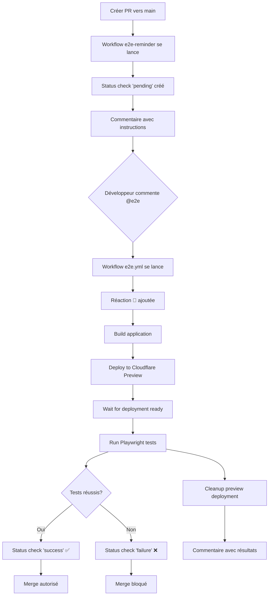

# E2E Tests avec Preview Deployments - Guide d'Implémentation

**Issue**: [#35 - Optimize OpenNext/Cloudflare startup time in CI](https://github.com/sebc-dev/website/issues/35)
**ADR**: [001 - Use Preview Deployments for E2E Tests in CI](../decisions/001-e2e-tests-preview-deployments.md)
**Status**: À implémenter après Story 1.3 (i18n)
**Estimation**: 3-4 heures

## Vue d'ensemble

Ce document fournit un guide pratique pour implémenter les tests E2E en CI en utilisant les preview deployments Cloudflare Workers, conformément à l'ADR-001.

### Problème résolu

- Tests E2E actuellement désactivés en CI à cause de timeouts (>60s) lors de l'initialisation de `wrangler dev`
- Tests fonctionnent parfaitement en local (~5-10s de démarrage)
- Besoin d'avoir les tests E2E dans le pipeline CI pour éviter les régressions

### Solution

Utiliser les preview deployments Cloudflare pour exécuter les tests E2E contre un environnement déployé plutôt qu'un serveur de développement local.

## Architecture de la solution

### Fonctionnement du système

**Déclenchement des tests** :
1. **Commenter `@e2e`** sur une PR pour lancer les tests E2E
2. Le workflow `e2e.yml` se déclenche automatiquement
3. Une réaction 🚀 est ajoutée au commentaire pour confirmer le déclenchement

**Protection de la branche `main`** :
1. Les PRs vers `main` reçoivent automatiquement un status check `e2e/preview-deployment` en état "pending"
2. Un commentaire automatique rappelle de commenter `@e2e` pour lancer les tests
3. Le merge est **bloqué** tant que le status check n'est pas "success"

**Avantages** :
- ✅ **Économie de ressources** : pas de tests à chaque push
- ✅ **Protection garantie** : impossible de merger sur `main` sans tests E2E
- ✅ **Flexibilité** : lancer les tests quand on veut sur les story branches
- ✅ **UX simple** : un commentaire `@e2e` suffit

### Diagramme de flux



## Phase 1: Configuration des Preview Deployments (1-2h)

### 1.1 Configuration Wrangler

Créer/modifier `wrangler.jsonc` pour supporter les environments de preview :

```jsonc
{
  "name": "website",
  "main": ".open-next/worker.js",
  "compatibility_date": "2024-09-23",
  "compatibility_flags": ["nodejs_compat"],
  "send_metrics": false,
  "assets": {
    "directory": ".open-next/assets",
    "binding": "ASSETS"
  },

  "env": {
    "production": {
      "name": "website-production",
      "routes": [
        {
          "pattern": "sebc.dev",
          "zone_name": "sebc.dev"
        }
      ]
    },
    "preview": {
      "name": "website-preview-*",
      "routes": []
    }
  }
}
```

**Notes importantes** :
- Le nom `website-preview-*` permettra de créer des déploiements uniques par PR
- Pas de routes configurées pour les previews (utilisation du domaine workers.dev par défaut)
- **OBLIGATOIRE** : `compatibility_flags: ["nodejs_compat"]` requis pour OpenNext/Next.js
- **OBLIGATOIRE** : `compatibility_date` doit être >= `2024-09-23` pour OpenNext
- Le `main` pointe vers le worker généré par OpenNext
- Les `assets` pointent vers le répertoire d'assets généré par OpenNext

### 1.2 Script de déploiement dynamique

Créer `scripts/deploy-preview.sh` :

```bash
#!/bin/bash
set -e

# Get PR number or branch name
PR_NUMBER=${GITHUB_PR_NUMBER:-$(git rev-parse --abbrev-ref HEAD | sed 's/[^a-zA-Z0-9-]/-/g')}
DEPLOYMENT_NAME="website-preview-${PR_NUMBER}"

echo "Deploying preview environment: ${DEPLOYMENT_NAME}"

# Build the application with OpenNext
echo "Building Next.js app with OpenNext..."
pnpm run deploy:build

# Deploy to Cloudflare Workers
echo "Deploying to Cloudflare Workers..."
pnpm wrangler deploy \
  --env preview \
  --name "${DEPLOYMENT_NAME}"

# Get deployment URL (format: <name>.<subdomain>.workers.dev)
SUBDOMAIN=$(pnpm wrangler whoami | grep -oP 'workers\.dev subdomain:\s+\K\S+' || echo "")
if [ -z "$SUBDOMAIN" ]; then
  # Fallback: try to extract from account info
  SUBDOMAIN=$(pnpm wrangler whoami 2>&1 | grep -oP '(?<=subdomain: )\S+' || echo "unknown")
fi

DEPLOYMENT_URL="https://${DEPLOYMENT_NAME}.${SUBDOMAIN}.workers.dev"

echo "Deployment URL: ${DEPLOYMENT_URL}"
echo "DEPLOYMENT_URL=${DEPLOYMENT_URL}" >> $GITHUB_OUTPUT
echo "DEPLOYMENT_NAME=${DEPLOYMENT_NAME}" >> $GITHUB_OUTPUT
```

**Notes sur le script** :
- Utilise `pnpm run deploy:build` qui devrait exécuter `opennextjs-cloudflare build`
- Ne spécifie pas `--outdir` car OpenNext génère déjà dans `.open-next/`
- Le flag `--env preview` utilise la config d'environment définie dans `wrangler.jsonc`
- Le flag `--name` override le nom pour créer un déploiement unique par PR
- L'URL de déploiement suit le format `<name>.<subdomain>.workers.dev`

Rendre le script exécutable :
```bash
chmod +x scripts/deploy-preview.sh
```

**Configuration package.json requise** :

Ajouter le script suivant à `package.json` :

```json
{
  "scripts": {
    "deploy:build": "opennextjs-cloudflare build"
  }
}
```

Ou si vous utilisez déjà `pnpm deploy` avec OpenNext, vous pouvez réutiliser la même commande de build.

### 1.3 Créer les workflows GitHub Actions

#### A. Workflow principal déclenché par commentaire

Créer `.github/workflows/e2e.yml` :

```yaml
name: E2E Tests (Preview Deployment)

on:
  issue_comment:
    types: [created]
  workflow_dispatch:
    inputs:
      pr_number:
        description: 'PR number to test'
        required: true
        type: string

env:
  PNPM_VERSION: 9.15.0
  NODE_VERSION: 20

jobs:
  # Check if comment triggers E2E tests
  check-trigger:
    name: Check E2E Trigger
    runs-on: ubuntu-latest
    if: |
      github.event_name == 'issue_comment' &&
      github.event.issue.pull_request &&
      (contains(github.event.comment.body, '@e2e') || contains(github.event.comment.body, '@e2e-test'))
    outputs:
      should_run: ${{ steps.check.outputs.should_run }}
      pr_number: ${{ steps.check.outputs.pr_number }}

    steps:
      - name: Check if should run
        id: check
        run: |
          echo "should_run=true" >> $GITHUB_OUTPUT
          echo "pr_number=${{ github.event.issue.number }}" >> $GITHUB_OUTPUT

      - name: Add reaction to comment
        uses: actions/github-script@v7
        with:
          script: |
            github.rest.reactions.createForIssueComment({
              owner: context.repo.owner,
              repo: context.repo.repo,
              comment_id: context.payload.comment.id,
              content: 'rocket'
            });

  e2e-preview:
    name: E2E Tests on Preview Deployment
    needs: [check-trigger]
    if: |
      always() &&
      (needs.check-trigger.outputs.should_run == 'true' || github.event_name == 'workflow_dispatch')
    runs-on: ubuntu-latest
    timeout-minutes: 15

    permissions:
      contents: read
      pull-requests: write
      statuses: write  # For status checks

    steps:
      - name: Get PR details
        id: pr
        uses: actions/github-script@v7
        with:
          script: |
            const prNumber = context.payload.issue?.number || '${{ github.event.inputs.pr_number }}';
            const { data: pr } = await github.rest.pulls.get({
              owner: context.repo.owner,
              repo: context.repo.repo,
              pull_number: prNumber
            });
            core.setOutput('ref', pr.head.ref);
            core.setOutput('sha', pr.head.sha);
            core.setOutput('number', prNumber);

      - name: Checkout PR code
        uses: actions/checkout@v4
        with:
          ref: ${{ steps.pr.outputs.ref }}

      - name: Create status check (pending)
        uses: actions/github-script@v7
        with:
          script: |
            await github.rest.repos.createCommitStatus({
              owner: context.repo.owner,
              repo: context.repo.repo,
              sha: '${{ steps.pr.outputs.sha }}',
              state: 'pending',
              target_url: '${{ github.server_url }}/${{ github.repository }}/actions/runs/${{ github.run_id }}',
              description: 'E2E tests running on preview deployment',
              context: 'e2e/preview-deployment'
            });

      - name: Setup pnpm
        uses: pnpm/action-setup@v4
        with:
          version: ${{ env.PNPM_VERSION }}

      - name: Setup Node.js
        uses: actions/setup-node@v4
        with:
          node-version: ${{ env.NODE_VERSION }}
          cache: 'pnpm'

      - name: Install dependencies
        run: pnpm install --frozen-lockfile

      - name: Setup Cloudflare credentials
        run: |
          echo "${{ secrets.CLOUDFLARE_API_TOKEN }}" > ~/.wrangler/config.toml

      - name: Deploy preview environment
        id: deploy
        env:
          CLOUDFLARE_API_TOKEN: ${{ secrets.CLOUDFLARE_API_TOKEN }}
          CLOUDFLARE_ACCOUNT_ID: ${{ secrets.CLOUDFLARE_ACCOUNT_ID }}
          GITHUB_PR_NUMBER: ${{ steps.pr.outputs.number }}
        run: ./scripts/deploy-preview.sh

      - name: Wait for deployment to be ready
        run: |
          DEPLOYMENT_URL="${{ steps.deploy.outputs.DEPLOYMENT_URL }}"
          echo "Waiting for ${DEPLOYMENT_URL} to respond..."

          # Wait up to 60 seconds for deployment to be ready
          for i in {1..12}; do
            if curl -sf "${DEPLOYMENT_URL}" > /dev/null; then
              echo "Deployment is ready!"
              exit 0
            fi
            echo "Waiting... (attempt $i/12)"
            sleep 5
          done

          echo "Deployment failed to become ready"
          exit 1

      - name: Install Playwright browsers
        run: pnpm exec playwright install chromium --with-deps

      - name: Run E2E tests
        env:
          PLAYWRIGHT_BASE_URL: ${{ steps.deploy.outputs.DEPLOYMENT_URL }}
        run: pnpm test:e2e

      - name: Upload test results
        if: always()
        uses: actions/upload-artifact@v4
        with:
          name: playwright-report
          path: playwright-report/
          retention-days: 7

      - name: Cleanup preview deployment
        if: always()
        env:
          CLOUDFLARE_API_TOKEN: ${{ secrets.CLOUDFLARE_API_TOKEN }}
          CLOUDFLARE_ACCOUNT_ID: ${{ secrets.CLOUDFLARE_ACCOUNT_ID }}
        run: |
          DEPLOYMENT_NAME="${{ steps.deploy.outputs.DEPLOYMENT_NAME }}"
          echo "Cleaning up deployment: ${DEPLOYMENT_NAME}"
          pnpm wrangler delete --name "${DEPLOYMENT_NAME}" --env preview || true

      - name: Update status check (success)
        if: success()
        uses: actions/github-script@v7
        with:
          script: |
            await github.rest.repos.createCommitStatus({
              owner: context.repo.owner,
              repo: context.repo.repo,
              sha: '${{ steps.pr.outputs.sha }}',
              state: 'success',
              target_url: '${{ github.server_url }}/${{ github.repository }}/actions/runs/${{ github.run_id }}',
              description: 'E2E tests passed ✅',
              context: 'e2e/preview-deployment'
            });

      - name: Update status check (failure)
        if: failure()
        uses: actions/github-script@v7
        with:
          script: |
            await github.rest.repos.createCommitStatus({
              owner: context.repo.owner,
              repo: context.repo.repo,
              sha: '${{ steps.pr.outputs.sha }}',
              state: 'failure',
              target_url: '${{ github.server_url }}/${{ github.repository }}/actions/runs/${{ github.run_id }}',
              description: 'E2E tests failed ❌',
              context: 'e2e/preview-deployment'
            });

      - name: Comment PR with results
        if: always()
        uses: actions/github-script@v7
        with:
          script: |
            const deploymentUrl = '${{ steps.deploy.outputs.DEPLOYMENT_URL }}';
            const testsPassed = '${{ job.status }}' === 'success';

            const body = testsPassed
              ? `✅ E2E tests passed on preview deployment!\n\n📦 Preview URL: ${deploymentUrl}\n\n*Triggered by @${{ github.event.comment.user.login }}*`
              : `❌ E2E tests failed on preview deployment.\n\n📦 Preview URL: ${deploymentUrl}\n\nCheck the [workflow logs](${{ github.server_url }}/${{ github.repository }}/actions/runs/${{ github.run_id }}) for details.\n\n*Triggered by @${{ github.event.comment.user.login }}*`;

            await github.rest.issues.createComment({
              issue_number: ${{ steps.pr.outputs.number }},
              owner: context.repo.owner,
              repo: context.repo.repo,
              body: body
            });
```

#### B. Workflow de rappel pour les PRs vers main

Créer `.github/workflows/e2e-reminder.yml` :

```yaml
name: E2E Reminder for Main

on:
  pull_request:
    types: [opened, ready_for_review]
    branches: [main]

jobs:
  e2e-reminder:
    name: Remind to run E2E tests
    runs-on: ubuntu-latest
    if: github.event.pull_request.draft == false

    permissions:
      pull-requests: write
      statuses: write

    steps:
      - name: Check if E2E already ran
        id: check
        uses: actions/github-script@v7
        with:
          script: |
            const { data: statuses } = await github.rest.repos.listCommitStatusesForRef({
              owner: context.repo.owner,
              repo: context.repo.repo,
              ref: context.payload.pull_request.head.sha
            });

            const e2eStatus = statuses.find(s => s.context === 'e2e/preview-deployment');
            const hasRun = e2eStatus && (e2eStatus.state === 'success' || e2eStatus.state === 'failure');

            core.setOutput('has_run', hasRun);
            core.setOutput('status', e2eStatus?.state || 'none');

      - name: Create pending status check
        if: steps.check.outputs.has_run != 'true'
        uses: actions/github-script@v7
        with:
          script: |
            await github.rest.repos.createCommitStatus({
              owner: context.repo.owner,
              repo: context.repo.repo,
              sha: context.payload.pull_request.head.sha,
              state: 'pending',
              description: 'E2E tests required before merge - Comment @e2e to run',
              context: 'e2e/preview-deployment'
            });

      - name: Comment with instructions
        if: steps.check.outputs.has_run != 'true'
        uses: actions/github-script@v7
        with:
          script: |
            const body = `## 🧪 E2E Tests Required

            This PR targets \`main\` and requires E2E tests to pass before merging.

            **To run E2E tests**, comment on this PR:
            \`\`\`
            @e2e
            \`\`\`

            The tests will run on a Cloudflare preview deployment and the results will be reported here.

            ---
            *This check is required for merging to \`main\`. See [ADR-001](../docs/decisions/001-e2e-tests-preview-deployments.md) for details.*`;

            await github.rest.issues.createComment({
              issue_number: context.payload.pull_request.number,
              owner: context.repo.owner,
              repo: context.repo.repo,
              body: body
            });
```

### 1.4 Configuration de la protection de branche (Branch Protection)

Pour rendre le status check `e2e/preview-deployment` obligatoire avant le merge sur `main` :

#### Via l'interface GitHub

1. Aller dans **Settings** → **Branches**
2. Modifier la règle de protection pour `main` (ou en créer une)
3. Activer **Require status checks to pass before merging**
4. Rechercher et sélectionner : `e2e/preview-deployment`
5. Sauvegarder les changements

#### Via GitHub CLI

```bash
# Ajouter le status check requis pour la branche main
gh api repos/:owner/:repo/branches/main/protection/required_status_checks \
  -X PATCH \
  -H "Accept: application/vnd.github+json" \
  -f "contexts[]=e2e/preview-deployment" \
  -F strict=true
```

**Résultat** :
- ✅ Les PRs vers `main` ne pourront pas être mergées sans que le check `e2e/preview-deployment` soit vert
- ✅ Le workflow de rappel créera automatiquement un status "pending" avec instructions
- ✅ Commenter `@e2e` lancera les tests et mettra à jour le status

### 1.5 Secrets Cloudflare requis

Ajouter les secrets suivants dans GitHub :
- `CLOUDFLARE_API_TOKEN`: Token API avec permissions Workers Scripts Write
- `CLOUDFLARE_ACCOUNT_ID`: ID du compte Cloudflare

```bash
# Commandes pour configurer les secrets
gh secret set CLOUDFLARE_API_TOKEN
gh secret set CLOUDFLARE_ACCOUNT_ID
```

## Phase 2: Configuration des tests E2E (1h)

### 2.1 Mise à jour de Playwright config

Modifier `playwright.config.ts` :

```typescript
import { defineConfig, devices } from '@playwright/test';

const baseURL = process.env.PLAYWRIGHT_BASE_URL || 'http://localhost:3000';

export default defineConfig({
  testDir: './tests',
  fullyParallel: true,
  forbidOnly: !!process.env.CI,
  retries: process.env.CI ? 2 : 0,  // Retry failed tests in CI
  workers: process.env.CI ? 1 : undefined,
  reporter: process.env.CI ? 'github' : 'html',

  use: {
    baseURL,
    trace: 'on-first-retry',
    screenshot: 'only-on-failure',
  },

  projects: [
    {
      name: 'chromium',
      use: { ...devices['Desktop Chrome'] },
    },
  ],

  // Only run local server when PLAYWRIGHT_BASE_URL is not set
  webServer: baseURL.startsWith('http://localhost') ? {
    command: 'pnpm dev',
    url: baseURL,
    reuseExistingServer: !process.env.CI,
    timeout: 120 * 1000,
  } : undefined,
});
```

**Changements clés**:
- Support de `PLAYWRIGHT_BASE_URL` pour les preview deployments
- Retries configurés pour gérer les problèmes réseau intermittents
- `webServer` conditionnel (seulement pour local)

### 2.2 Mise à jour des tests pour la résilience réseau

Ajouter des attentes et retries dans les tests :

```typescript
// tests/example.spec.ts
import { test, expect } from '@playwright/test';

test.describe('Homepage', () => {
  test('should load successfully', async ({ page }) => {
    // Navigate with retry on network errors
    await page.goto('/', { waitUntil: 'networkidle' });

    // Wait for content to be visible
    await expect(page.locator('h1')).toBeVisible({ timeout: 10000 });
  });
});
```

### 2.3 Script de vérification du déploiement

Créer `scripts/wait-for-deployment.sh` (déjà intégré dans le workflow) :

```bash
#!/bin/bash
set -e

DEPLOYMENT_URL=$1
MAX_ATTEMPTS=${2:-12}
SLEEP_DURATION=${3:-5}

if [ -z "$DEPLOYMENT_URL" ]; then
  echo "Usage: $0 <deployment-url> [max-attempts] [sleep-duration]"
  exit 1
fi

echo "Waiting for ${DEPLOYMENT_URL} to be ready..."

for i in $(seq 1 $MAX_ATTEMPTS); do
  if curl -sf "${DEPLOYMENT_URL}" > /dev/null; then
    echo "✅ Deployment is ready!"
    exit 0
  fi
  echo "⏳ Waiting... (attempt $i/$MAX_ATTEMPTS)"
  sleep $SLEEP_DURATION
done

echo "❌ Deployment failed to become ready after $MAX_ATTEMPTS attempts"
exit 1
```

## Phase 3: Intégration et nettoyage (30min)

### 3.1 Mettre à jour la documentation

#### Modifier `CLAUDE.md`

Ajouter une section sur les tests E2E :

```markdown
### E2E Testing Strategy

**Local Development**:
- Run `pnpm test:e2e` to test against local dev server

**CI (Preview Deployments)**:
- Tests run on Cloudflare Workers preview deployments
- **Triggering**: Comment `@e2e` on any PR to run tests
- **For PRs to `main`**: E2E tests are **required** before merge
  - Status check `e2e/preview-deployment` must be "success"
  - Automatic reminder comment when PR is opened

**How it works**:
1. Comment `@e2e` on the PR
2. Workflow deploys to Cloudflare preview environment
3. Playwright tests run against preview URL
4. Status check updated with results
5. Preview environment automatically cleaned up

**Preview URLs**: Available in PR comments after workflow runs

See [E2E Implementation Guide](docs/deployment/e2e-preview-deployments-implementation.md) and [ADR-001](docs/decisions/001-e2e-tests-preview-deployments.md) for details.
```

#### Modifier `README.md`

Ajouter dans la section Testing :

```markdown
#### E2E Tests in CI

E2E tests in CI use Cloudflare preview deployments for a production-like environment.

**Running E2E tests on a PR**:
- Comment `@e2e` on the PR to trigger tests
- Tests run on a dedicated preview deployment
- Results posted as comment and status check

**For PRs to `main`**:
- E2E tests are **required** before merge
- Status check `e2e/preview-deployment` must pass
- Comment `@e2e` to run tests and unlock merge

**Why preview deployments?**
- Eliminates `wrangler dev` timeout issues in CI
- Tests against actual Cloudflare Workers environment
- More representative of production behavior
- No resource waste from running tests on every push

See [E2E Implementation Guide](docs/deployment/e2e-preview-deployments-implementation.md) and [ADR-001](docs/decisions/001-e2e-tests-preview-deployments.md) for complete details.
```

### 3.2 Retirer la section E2E désactivée de quality.yml

Modifier `.github/workflows/quality.yml` :

```yaml
# Supprimer ou commenter cette section :
# - name: Run E2E tests
#   run: pnpm test:e2e
#   timeout-minutes: 5
#   # Temporarily disabled - see issue #35
```

Ajouter un commentaire de référence :

```yaml
# Note: E2E tests are run in a separate workflow (e2e.yml)
# using Cloudflare preview deployments. See ADR-001 and issue #35.
```

### 3.3 Template de PR

Créer/modifier `.github/pull_request_template.md` :

```markdown
## Description

<!-- Describe your changes -->

## Type of Change

- [ ] Bug fix
- [ ] New feature
- [ ] Breaking change
- [ ] Documentation update
- [ ] Refactoring
- [ ] Performance improvement
- [ ] Test improvements

## Testing

- [ ] Unit tests pass locally (`pnpm test`)
- [ ] E2E tests pass locally (`pnpm test:e2e`)
- [ ] For PRs to `main`: E2E tests run in CI (comment `@e2e` to trigger)

## Checklist

- [ ] Code follows project style guidelines
- [ ] Self-review completed
- [ ] Comments added for complex code
- [ ] Documentation updated
- [ ] No new warnings generated
- [ ] Gitmoji used in commit message

## E2E Tests (for PRs to main)

**Required before merge**: Comment `@e2e` on this PR to run E2E tests on a Cloudflare preview deployment.

The workflow will:
1. Deploy to a preview environment
2. Run Playwright tests
3. Report results and update status check
4. Cleanup the preview deployment

**Note**: This is required for merging to `main`. See [ADR-001](docs/decisions/001-e2e-tests-preview-deployments.md).
```

### 3.4 Créer un script de nettoyage manuel

Créer `scripts/cleanup-previews.sh` pour nettoyer les previews orphelins :

```bash
#!/bin/bash
set -e

# List all preview deployments
echo "Listing preview deployments..."

pnpm wrangler deployments list --env preview | grep "website-preview-" | while read -r deployment; do
  DEPLOYMENT_NAME=$(echo "$deployment" | awk '{print $1}')
  echo "Found: ${DEPLOYMENT_NAME}"

  # Optionally delete old deployments
  read -p "Delete ${DEPLOYMENT_NAME}? (y/n) " -n 1 -r
  echo
  if [[ $REPLY =~ ^[Yy]$ ]]; then
    pnpm wrangler delete --name "${DEPLOYMENT_NAME}" --env preview
    echo "Deleted ${DEPLOYMENT_NAME}"
  fi
done

echo "Cleanup complete!"
```

## Exemples d'utilisation

### Scénario 1 : PR vers une story branch

```
Développeur crée PR story_1_4 → story_1_3
├─ Aucun workflow automatique de E2E
├─ Développeur commente "@e2e" quand prêt
├─ Workflow e2e.yml se lance
├─ Tests passent et status check "success"
└─ Merge autorisé (pas de protection stricte sur story branches)
```

### Scénario 2 : PR vers main (première ouverture)

```
Développeur crée PR story_1_3 → main
├─ Workflow e2e-reminder.yml se lance automatiquement
├─ Status check "pending" créé : "E2E tests required before merge - Comment @e2e to run"
├─ Commentaire automatique avec instructions
├─ Bouton "Merge" désactivé (status check requis)
└─ Développeur doit commenter "@e2e" pour débloquer le merge
```

### Scénario 3 : Lancer les tests E2E

```
Développeur commente "@e2e" sur la PR
├─ Réaction 🚀 ajoutée au commentaire
├─ Workflow e2e.yml se lance
├─ Application buildée et déployée sur Cloudflare Preview
├─ Tests Playwright exécutés contre l'URL de preview
├─ Status check mis à jour : "success" ✅ ou "failure" ❌
├─ Commentaire avec résultats et URL de preview
├─ Preview deployment nettoyé automatiquement
└─ Si success : bouton "Merge" activé sur PR vers main
```

### Scénario 4 : Re-run des tests après modifications

```
Développeur push de nouveaux commits après un échec de tests
├─ Status check reste inchangé (dernier résultat)
├─ Développeur commente à nouveau "@e2e"
├─ Nouveau cycle de tests se lance
└─ Status check mis à jour avec les nouveaux résultats
```

### Scénario 5 : Workflow manuel (workflow_dispatch)

```
Développeur va dans Actions → E2E Tests → Run workflow
├─ Saisie du numéro de PR
├─ Workflow se lance comme si déclenché par commentaire
└─ Utile pour debug ou re-run sans commentaire supplémentaire
```

## Vérification et tests

### Checklist de vérification avant déploiement

**Configuration** :
- [ ] Secrets Cloudflare configurés dans GitHub (`CLOUDFLARE_API_TOKEN`, `CLOUDFLARE_ACCOUNT_ID`)
- [ ] `wrangler.jsonc` mis à jour avec env preview
- [ ] Protection de branche configurée sur `main` avec status check `e2e/preview-deployment`

**Fichiers créés/modifiés** :
- [ ] Script `scripts/deploy-preview.sh` créé et exécutable
- [ ] Workflow `.github/workflows/e2e.yml` créé (déclenchement par commentaire)
- [ ] Workflow `.github/workflows/e2e-reminder.yml` créé (rappel pour main)
- [ ] `playwright.config.ts` mis à jour avec support de `PLAYWRIGHT_BASE_URL`
- [ ] Documentation mise à jour (CLAUDE.md, README.md)
- [ ] Section E2E retirée de `.github/workflows/quality.yml`
- [ ] PR template `.github/pull_request_template.md` créé/mis à jour

**Validation** :
- [ ] Tests E2E locaux passent : `pnpm test:e2e`
- [ ] Tests de validation passés (voir ci-dessous)

### Tests de validation

1. **Test local** :
   ```bash
   pnpm test:e2e
   ```

2. **Test du script de déploiement** (si secrets configurés) :
   ```bash
   export CLOUDFLARE_API_TOKEN="..."
   export CLOUDFLARE_ACCOUNT_ID="..."
   export GITHUB_PR_NUMBER="test"
   ./scripts/deploy-preview.sh
   ```

3. **Test du workflow complet sur PR vers story branch** :
   - Créer une PR de test vers une story branch
   - Commenter `@e2e` sur la PR
   - Vérifier la réaction 🚀 sur le commentaire
   - Vérifier que le workflow `e2e.yml` se lance
   - Vérifier le commentaire de PR avec l'URL de preview et les résultats
   - Vérifier que le status check est mis à jour
   - Vérifier que le nettoyage s'effectue

4. **Test du workflow complet sur PR vers main** :
   - Créer une PR de test vers `main`
   - Vérifier que le workflow `e2e-reminder.yml` se lance automatiquement
   - Vérifier le status check "pending" avec message d'instruction
   - Vérifier le commentaire automatique avec instructions
   - Commenter `@e2e` sur la PR
   - Vérifier que les tests se lancent et le status check passe à "success"
   - Vérifier que le merge est autorisé

## Métriques de succès

### Objectifs quantitatifs

- ✅ Temps d'exécution des tests E2E < 5 minutes (incluant déploiement)
- ✅ Taux de succès > 95% (pas de timeouts)
- ✅ Zéro deployments preview orphelins après 24h
- ✅ Temps de déploiement < 60 secondes

### Objectifs qualitatifs

- ✅ Tests E2E activables à la demande sur toutes les PRs
- ✅ Tests E2E obligatoires pour merger sur `main`
- ✅ Environnement de test représentatif de la production
- ✅ Feedback rapide pour les développeurs
- ✅ Documentation claire et à jour

## Monitoring et maintenance

### Suivi des quotas Cloudflare

Vérifier régulièrement l'utilisation :

```bash
# Liste les déploiements actifs
pnpm wrangler deployments list --env preview

# Compte les previews actifs
pnpm wrangler deployments list --env preview | grep -c "website-preview-"
```

### Nettoyage périodique

Exécuter le script de nettoyage hebdomadairement :

```bash
./scripts/cleanup-previews.sh
```

### Dashboard de monitoring

Ajouter au README un lien vers les métriques :

- Workflows GitHub Actions : https://github.com/sebc-dev/website/actions/workflows/e2e.yml
- Cloudflare Workers Dashboard : https://dash.cloudflare.com/

## FAQ (Foire Aux Questions)

### Comment lancer les tests E2E sur ma PR ?

Commentez simplement `@e2e` sur la PR. Le workflow se lancera automatiquement.

### Pourquoi ne pas lancer les tests à chaque push ?

Pour économiser les ressources Cloudflare et les minutes GitHub Actions. Les tests E2E sont coûteux en temps et en quotas de déploiement.

### Que se passe-t-il si j'oublie de lancer les tests avant de vouloir merger vers main ?

Le merge sera bloqué par le status check `e2e/preview-deployment` qui restera en état "pending". Un commentaire automatique vous rappellera de commenter `@e2e`.

### Puis-je lancer les tests plusieurs fois sur la même PR ?

Oui ! Commentez à nouveau `@e2e` autant de fois que nécessaire. Chaque exécution mettra à jour le status check.

### Comment relancer les tests après un échec ?

Commentez à nouveau `@e2e` sur la PR. Un nouveau cycle de tests se lancera.

### Où trouver l'URL du preview deployment ?

L'URL est disponible dans le commentaire automatique posté après l'exécution des tests.

### Combien de temps prennent les tests E2E ?

Environ 3-5 minutes incluant le déploiement, l'exécution des tests et le nettoyage.

### Que se passe-t-il si le cleanup échoue ?

Le step de cleanup utilise `|| true` pour ne pas faire échouer le workflow. Vous pouvez nettoyer manuellement avec le script `scripts/cleanup-previews.sh`.

### Puis-je tester sur une story branch ?

Oui ! Commentez `@e2e` sur n'importe quelle PR. Les tests E2E ne sont obligatoires que pour les PRs vers `main`.

### Comment voir les logs détaillés des tests ?

Cliquez sur le lien dans le commentaire de résultats qui pointe vers les logs du workflow GitHub Actions.

## Dépannage

### Problème : Le déploiement échoue

**Symptômes** : Erreur lors de `wrangler deploy`

**Solutions** :
1. Vérifier que les secrets sont correctement configurés
2. Vérifier les permissions du token API Cloudflare
3. Vérifier les quotas du compte Cloudflare

### Problème : Les tests échouent en CI mais passent en local

**Symptômes** : Tests verts en local, rouges en preview

**Solutions** :
1. Vérifier les variables d'environnement spécifiques à la preview
2. Vérifier les différences de comportement Cloudflare Workers vs local
3. Augmenter les timeouts dans les tests
4. Activer les retries dans playwright.config.ts

### Problème : Previews non nettoyés

**Symptômes** : Accumulation de deployments preview

**Solutions** :
1. Vérifier que le step cleanup s'exécute (if: always())
2. Exécuter le script de nettoyage manuel
3. Vérifier les logs du workflow pour les erreurs de cleanup

## Validation avec la documentation officielle Cloudflare

Ce document a été validé contre la documentation officielle Cloudflare Workers et OpenNext :

### ✅ Points validés

1. **Configuration Wrangler** :
   - Structure `env.preview` conforme à la [documentation officielle](https://developers.cloudflare.com/workers/wrangler/environments/)
   - Naming convention `<name>-<environment>` validée
   - Flags de compatibilité obligatoires pour OpenNext respectés

2. **Commandes Wrangler** :
   - `wrangler deploy --env preview --name <name>` validé
   - `wrangler delete --name <name> --env preview` validé
   - Pas besoin de `--outdir` car géré par OpenNext

3. **OpenNext/Next.js sur Cloudflare** :
   - Configuration `main: ".open-next/worker.js"` conforme
   - Assets binding `ASSETS` avec directory `.open-next/assets` conforme
   - Compatibility flags `nodejs_compat` requis
   - Compatibility date >= `2024-09-23` requis

### 📚 Références aux sources officielles

- [Wrangler Environments](https://developers.cloudflare.com/workers/wrangler/environments/)
- [Wrangler Commands: deploy](https://developers.cloudflare.com/workers/wrangler/commands/#deploy)
- [Wrangler Commands: delete](https://developers.cloudflare.com/workers/wrangler/commands/#delete)
- [Next.js on Cloudflare Workers](https://developers.cloudflare.com/workers/framework-guides/web-apps/nextjs)
- [OpenNext Cloudflare Documentation](https://opennext.js.org/cloudflare)

## Références

- **Issue GitHub** : [#35 - Optimize OpenNext/Cloudflare startup time in CI](https://github.com/sebc-dev/website/issues/35)
- **ADR** : [001 - Use Preview Deployments for E2E Tests in CI](../decisions/001-e2e-tests-preview-deployments.md)
- **Documentation Cloudflare** :
  - [Wrangler deploy](https://developers.cloudflare.com/workers/wrangler/commands/#deploy)
  - [Workers environments](https://developers.cloudflare.com/workers/wrangler/environments/)
  - [Preview URLs](https://developers.cloudflare.com/workers/configuration/previews/)
- **Documentation Playwright** :
  - [CI configuration](https://playwright.dev/docs/ci)
  - [Base URL](https://playwright.dev/docs/test-webserver#adding-a-baseurl)

## Historique des révisions

- **2025-11-19** : Validation avec documentation Cloudflare officielle + ajout OpenNext config
- **2025-11-19** : Ajout système de déclenchement par commentaire `@e2e` + protection branche
- **2025-11-19** : Création du document d'implémentation
- **2025-11-17** : Décision documentée dans ADR-001
- **2025-11-17** : Issue #35 créée
