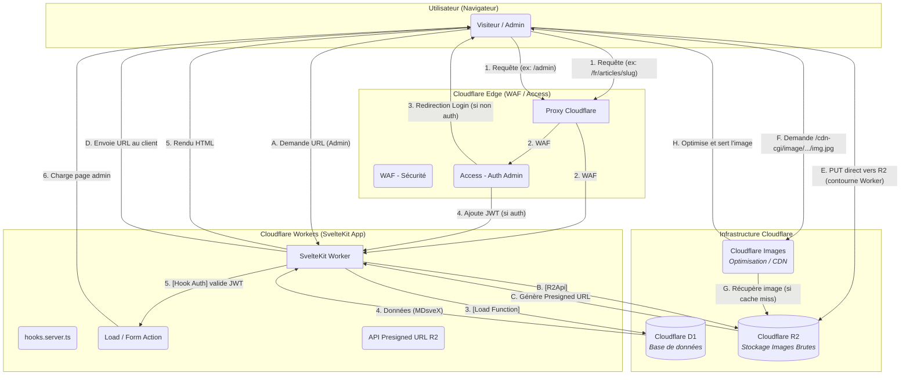
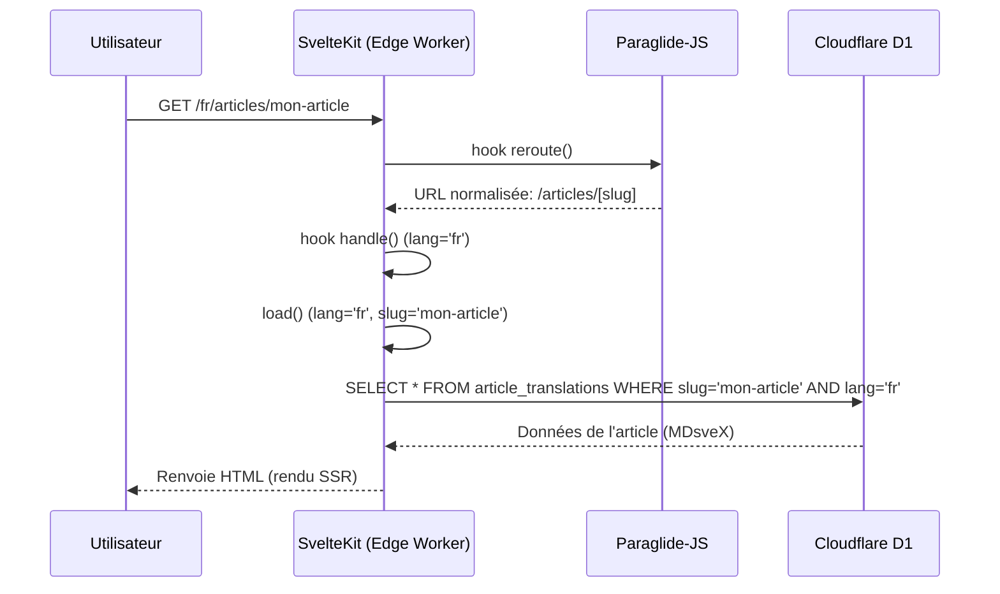
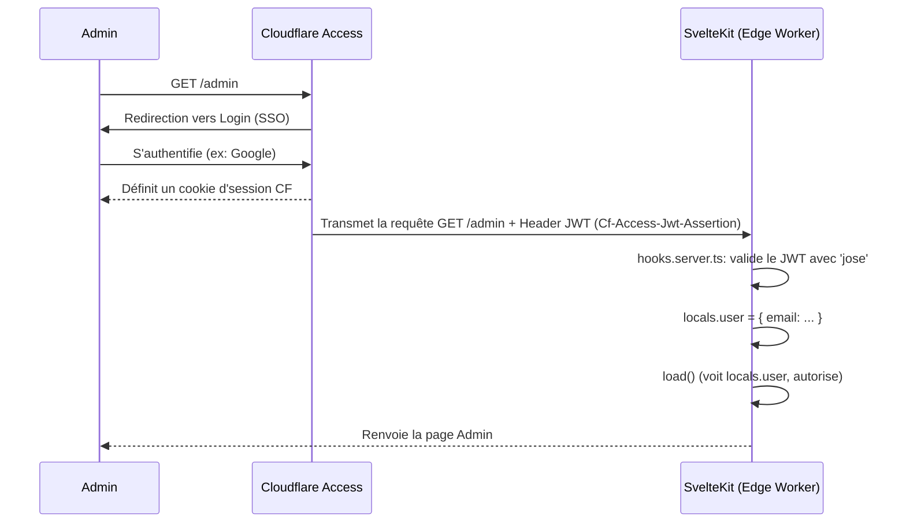
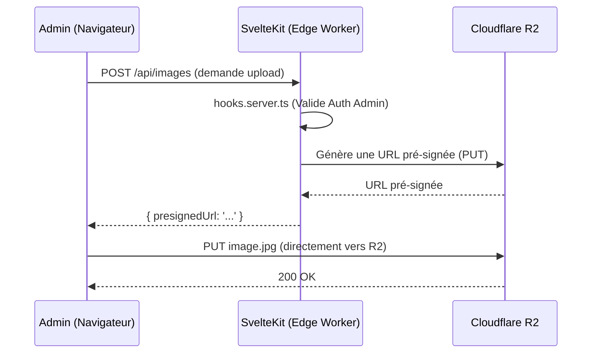

# Document d'Architecture Full-Stack : sebc.dev

## Introduction

Ce document définit l'architecture technique complète (full-stack) du projet `sebc.dev`. Il sert de source unique de vérité pour guider le développement, en assurant la cohérence entre le frontend, le backend, la base de données et l'infrastructure.

Le projet est un blog technique bilingue (FR/EN) moderne, construit sur une stack SvelteKit 5 et Cloudflare, conçu pour une performance "edge-first" et une maintenabilité à long terme.

### Modèle de Démarrage

L'initialisation du projet est une décision architecturale critique. Nous utiliserons **obligatoirement** le scaffolding `create-cloudflare` (C3) :
`pnpm create cloudflare@latest --framework=svelte --platform=workers`

Cette approche garantit une configuration initiale correcte, notamment :

  * L'**adapter-cloudflare** de SvelteKit (`@sveltejs/adapter-cloudflare`), qui intègre le support des Workers et l'accès aux bindings Cloudflare (D1, R2) via `event.platform.env`.
  * La configuration adéquate de `wrangler.toml` pour le déploiement en mode "Workers".
  * Note: Les templates modernes n'utilisent plus le plugin `@cloudflare/vite-plugin` séparément - l'adapter gère l'intégration.

## Architecture de Haut Niveau

### Résumé Technique

`sebc.dev` est une application SvelteKit 5 full-stack, monolithique et "serverless", déployée sur **Cloudflare Workers**.

L'architecture s'articule autour des principes suivants :

  * **Frontend (UI)** : Rendu par SvelteKit 5 (utilisant les **Runes**) et stylisé avec **TailwindCSS 4** et **shadcn-svelte**.
  * **Backend (Logique)** : Géré par les **SvelteKit Form Actions** et les **Load Functions** (`+page.server.ts`) s'exécutant sur Cloudflare Workers.
  * **Base de Données** : **Cloudflare D1** (SQLite serverless), requêtée via l'ORM **Drizzle**.
  * **Stockage Média** : **Cloudflare R2** pour les images, avec optimisation via **Cloudflare Images**.
  * **Internationalisation (i18n)** : Gérée par **Paraglide-JS** pour le routage bilingue (`/fr`, `/en`) et la compilation des traductions.
  * **Authentification (Admin)** : Sécurisée en V1 par **Cloudflare Access** (Zero Trust).

### Plateforme et Infrastructure

La plateforme unique est **Cloudflare**. Cette approche "edge-first" élimine la gestion d'infrastructure traditionnelle (VPS, Docker, pare-feu).

  * **Plateforme** : Cloudflare (Workers, Pages).
  * **Services Clés (V1)** :
      * **Cloudflare Workers** : Runtime pour l'application SvelteKit.
      * **Cloudflare D1** : Base de données primaire.
      * **Cloudflare R2** : Stockage des images brutes.
      * **Cloudflare Images** : Optimisation et transformation des images à la volée.
      * **Cloudflare Access** : Sécurisation Zero Trust de la route `/admin`.
      * **Cloudflare WAF** : Protection contre les menaces web (XSS, SQLi).
      * **Cloudflare Web Analytics** : Suivi analytique V1.

### Structure du Répertoire

Le projet adoptera une structure de **monorepo SvelteKit standard**. Il ne s'agit pas d'un monorepo complexe (type Nx/Turborepo) en V1, mais d'une application unique SvelteKit co-localisant le frontend et le backend.

### Diagramme d'Architecture

Voici la visualisation du flux système complet pour `sebc.dev` :

### Patterns Architecturaux

  * **Full-stack Serverless** : L'application SvelteKit s'exécute en tant que Worker Cloudflare.
  * **Composants UI** : Approche basée sur Svelte 5 Runes et `shadcn-svelte` (composants "copy-paste").
  * **Backend For Frontend (BFF)** : Les `load functions` de SvelteKit agissent comme un BFF, préparant les données spécifiquement pour les vues.
  * **ORM (Drizzle)** : Utilisation de Drizzle pour abstraire les requêtes D1 de manière type-safe.
  * **Validation de Bout en Bout** : Chaîne de validation `Drizzle Schema` -\> `drizzle-zod` -\> `Zod` -\> `sveltekit-superforms` pour les Form Actions.
  * **Authentification Zero Trust** : Cloudflare Access gère l'authentification admin ; SvelteKit ne fait que *valider* le JWT fourni.

-----

## Stack Technique (V1)

Voici la source de vérité unique pour les technologies et versions du projet.

| Catégorie | Technologie | Version | Rôle |
| :--- | :--- | :--- | :--- |
| **Framework** | SvelteKit | 5.0+ | Framework full-stack |
| **Langage UI** | Svelte 5 (Runes) | 5.0+ | Réactivité de l'interface |
| **Backend** | SvelteKit (Server) | 5.0+ | Load/Form Actions, API Endpoints |
| **Runtime** | Cloudflare Workers | latest | Exécution Serverless |
| **Base de Données** | Cloudflare D1 | N/A | Stockage (Articles, Taxonomie) |
| **ORM** | Drizzle ORM | latest | Accès base de données type-safe |
| **Stockage Fichiers** | Cloudflare R2 | N/A | Stockage images brutes |
| **Optim. Images** | Cloudflare Images | N/A | Transformation et CDN |
| **Styling** | TailwindCSS | 4.0+ | Framework CSS Utility-first |
| **Composants UI** | shadcn-svelte | latest | Bibliothèque de composants accessibles |
| **i18n** | Paraglide-JS | latest | Routage et traductions (compiler-based) |
| **Contenu** | MDsveX | latest | Rendu Markdown + Svelte |
| **Auth Admin (V1)** | Cloudflare Access | N/A | Sécurisation Zero Trust |
| **Validation** | Zod + sveltekit-superforms | latest | Validation des formulaires |
| **Tests (Composant)** | Vitest (Browser Mode) | latest | Tests de composants en navigateur réel |
| **Tests (E2E)** | Playwright | latest | Tests End-to-End avec fixtures DB |
| **Déploiement** | GitHub Actions | v4 | CI/CD |

-----

## 4\. Modèles de Données (Logique)

Conformément à la contrainte de ne pas inclure de code, voici la description en prose des entités de données. Le schéma Drizzle sera directement basé sur cette logique.

  * **`articles` (Article)** : Entité centrale contenant les métadonnées partagées par les deux langues.
      * Champs clés : ID, Catégorie (relation), Complexité (`beginner`, `intermediate`, `advanced`), Statut (`draft`, `published`), Date de publication, Image de couverture (lien R2).
  * **`article_translations` (Traduction d'Article)** : Table relationnelle (1-N avec `articles`) contenant le contenu spécifique à une langue.
      * Champs clés : ID, Article ID (relation), Langue (`fr`, `en`), Titre, Slug, Extrait (pour SEO), Contenu MDsveX.
      * *Note (EF23)* : Un article ne peut être publié que si les deux traductions (FR et EN) sont complètes.
  * **`categories` (Catégorie)** : Les 9 catégories canoniques prédéfinies.
      * Champs clés : ID (ex: `news`), Nom (FR/EN), Slug (FR/EN), Icône, Couleur (pour l'UI).
  * **`tags` (Tag)** : Taxonomie flexible gérée par l'admin.
      * Champs clés : ID, Nom (FR/EN).
  * **`articleTags` (Jointure)** : Table de jointure Many-to-Many entre `articles` et `tags`.

-----

## Spécification des APIs

L'application n'expose pas d'API de contenu publique (les données sont chargées via les `load functions`). Cependant, elle utilise des `+server.ts` (endpoints SvelteKit) pour des tâches spécifiques :

  * **`GET /api/health`** : Endpoint public pour les Health Checks de Cloudflare. Vérifie la connectivité à D1 et retourne un JSON `{ status: 'ok' }`.
  * **`GET /api/articles`** : Endpoint JSON pour le Hub de Recherche (utilisé si le filtrage côté client est privilégié, bien que V1 favorise le rechargement via `load` pour SSR).
  * **`POST /api/images` (Protégé Admin)** : Endpoint sécurisé qui génère et retourne une URL pré-signée Cloudflare R2, permettant au client d'uploader une image directement vers R2.
  * **`GET /sitemap.xml`** : Endpoint public qui génère dynamiquement le sitemap XML en requêtant la table `articles` (status `published`) dans D1.

-----

## Composants Logiques

L'architecture est décomposée en services logiques hébergés sur la plateforme Cloudflare:

  * **Application Web (Worker SvelteKit)** : Le composant principal. Gère le routage, le rendu (SSR), l'exécution de la logique métier (Form Actions), la validation (Zod) et la coordination des autres services.
  * **Service d'Authentification (Cloudflare Access)** : Proxy externe gérant l'authentification Zero Trust pour la route `/admin`.
  * **Service de Validation (SvelteKit Hook)** : Intercepte les requêtes admin, valide le JWT `Cf-Access-Jwt-Assertion` en utilisant `jose` dans `hooks.server.ts`.
  * **Service de Base de Données (Cloudflare D1)** : Stockage des données textuelles et métadonnées.
  * **Service de Stockage (Cloudflare R2)** : Stockage des objets binaires (images brutes).
  * **Service d'Images (Cloudflare Images)** : Service Edge pour la transformation et la mise en cache des images.

-----

## APIs Externes (V1)

Pour la V1, le projet est entièrement autonome sur l'infrastructure Cloudflare et ne dépend d'aucune API tierce critique pour son fonctionnement.

*Note : Resend (pour les emails Post-V1) est identifié mais hors scope V1*.

-----

## Flux de Travail Principaux (Workflows)

Voici les flux de données et d'interaction clés, visualisés (les diagrammes ne sont pas du code).

### Flux de Lecture (Utilisateur Public)

Ce flux décrit comment un visiteur lit un article, en incluant l'i18n.

### Flux d'Authentification (Admin)

Ce flux utilise le modèle Zero Trust de Cloudflare Access.

### Flux d'Upload d'Image (Admin)

Ce flux utilise des URLs pré-signées pour contourner les limites du Worker.

-----

## Architecture Frontend

L'architecture frontend est détaillée dans `Frontend_Specification.md`, mais les points clés sont résumés ici:

  * **Structure des Composants** : Les composants sont organisés par fonctionnalité (`features`), par disposition (`layout`) et par éléments réutilisables (`ui` - basés sur shadcn).
  * **Gestion d'État (State Management)** :
      * **État local/composant** : Svelte 5 Runes (`$state`, `$derived`).
      * **État global (Client)** : `  $state ` exporté depuis un fichier `.svelte.ts` (ex: thème UI).
      * **État "Requête" (Utilisateur)** : *Ne pas* utiliser de `$state` global (risque de fuite de données en SSR). L'état de l'utilisateur provient de `locals.user` et est passé aux composants via les props `data`.
      * **État des Filtres (Hub)** : L'URL (`URLSearchParams`) est la source de vérité, gérée via `goto()` et lue via les `load functions`.
  * **Routage** : Géré par SvelteKit (système de fichiers) et modifié par le hook `reroute` de Paraglide-JS pour l'i18n.

-----

## Architecture Backend

L'architecture backend est entièrement "serverless", intégrée à SvelteKit et s'exécutant sur Cloudflare Workers.

  * **Architecture de Service** : Logique métier co-localisée avec les routes :
      * `+page.server.ts` (Form Actions, Load Functions) pour la logique liée aux pages.
      * `+server.ts` (API Endpoints) pour les ressources JSON ou les tâches spécifiques (ex: upload).
  * **Couche d'Accès aux Données** : Centralisée via Drizzle ORM. Les requêtes sont écrites dans `src/lib/server/db/` et appelées depuis les `load` ou `action`.
  * **Authentification** : Gérée par Cloudflare Access. La logique applicative se limite à la *validation* du JWT dans `hooks.server.ts`.

-----

## Structure Unifiée du Projet

La structure des fichiers (décrite en prose, sans code) est définie dans `Frontend_Specification.md`. Les répertoires clés sont :

  * **`src/routes`** : Contient toutes les pages, layouts, actions, et endpoints API. C'est le cœur de l'application.
  * **`src/lib/components`** : Contient tous les composants Svelte, organisés par `layout`, `features`, et `ui` (shadcn).
  * **`src/lib/server`** : Code *exclusivement* serveur (ex: logique Drizzle, validation auth). SvelteKit empêche l'importation de ce code côté client.
  * **`src/lib/i18n`** : Configuration de Paraglide-JS.
  * **`messages`** (à la racine) : Fichiers `fr.json` et `en.json` pour Paraglide.
  * **`tests`** (à la racine) : Contient les tests unitaires (Vitest) et E2E (Playwright).

-----

## Flux de Développement

  * **Démarrage** : `pnpm dev` lance le serveur Vite unifié, fournissant le HMR et l'accès aux bindings locaux (`.dev.vars`, D1 local).
  * **Source de Vérité (Env)** : Les secrets et bindings côté serveur sont *exclusivement* accessibles via `event.platform.env`. L'utilisation des modules `$env` de SvelteKit côté serveur est proscrite pour éviter les conflits.
  * **Migrations DB** : Processus en deux étapes :
    1.  `pnpm db:generate` (Drizzle Kit génère le SQL).
    2.  `pnpm db:migrate:local` (Wrangler applique le SQL à D1 local).

-----

## Architecture de Déploiement

  * **Plateforme** : Cloudflare (Workers).
  * **CI/CD** : Pipeline GitHub Actions.
  * **Processus CI/CD (Obligatoire)** : Le pipeline doit exécuter les étapes suivantes dans l'ordre :
    1.  Installation des dépendances (`pnpm install`).
    2.  Lint & Type-check (`pnpm lint`).
    3.  Tests (`pnpm test` - Vitest, Playwright).
    4.  Build de l'application (`pnpm build`).
    5.  **Étape 1 Déploiement :** Migration de la base de données (`wrangler d1 migrations apply DB --remote`).
    6.  **Étape 2 Déploiement :** Déploiement du code Worker (`wrangler deploy`).

-----

## Sécurité et Performance

### Sécurité

  * **Authentification Admin** : Cloudflare Access (Zero Trust).
  * **Protection Réseau** : Cloudflare WAF (XSS, SQLi).
  * **CSRF** : Protection native de SvelteKit (vérification de l'origine) activée.
  * **Validation des Entrées** : Validation Zod/Superforms côté serveur sur *toutes* les Form Actions.

### Performance

  * **Runtime** : Exécution à l'Edge (Cloudflare Workers) pour une latence minimale.
  * **Images** : Optimisation à la volée via Cloudflare Images.
  * **Cache (V1)** : Utilisation de l'API Cache standard de Cloudflare avec des en-têtes `Cache-Control`.
  * **Code** : Bundles optimisés et code-splitting par route (natif à SvelteKit).
  * **Objectifs V1** : LCP \< 2.5s, INP \< 100ms, CLS \< 0.1.

-----

## Stratégie de Test

La stratégie de test est conçue pour une haute fidélité :

  * **Tests Unitaires** : `Vitest` pour la logique métier pure (ex: `src/lib/utils`).
  * **Tests de Composants** : **`Vitest Browser Mode`** (et non JSDOM). Les tests s'exécutent dans un vrai navigateur (Chromium), garantissant la compatibilité avec Svelte 5 Runes.
  * **Tests E2E (End-to-End)** : **`Playwright`**. Les tests E2E utiliseront des *fixtures de base de données* pour ensemencer (seed) et réinitialiser (reset) la base D1 locale avant chaque test, assurant l'isolation.

-----

## Monitoring et Observabilité (V1)

  * **Monitoring de Santé** : **Cloudflare Health Checks** configurés pour interroger l'endpoint `GET /health`.
  * **Métriques de Performance** : **Workers Metrics** et **Log Explorer** via le tableau de bord Cloudflare.
  * **Analytics (Utilisateur)** : **Cloudflare Web Analytics** (privacy-first).
  * **Sauvegardes** : **Cloudflare D1 Time Travel** (Point-in-Time Recovery).