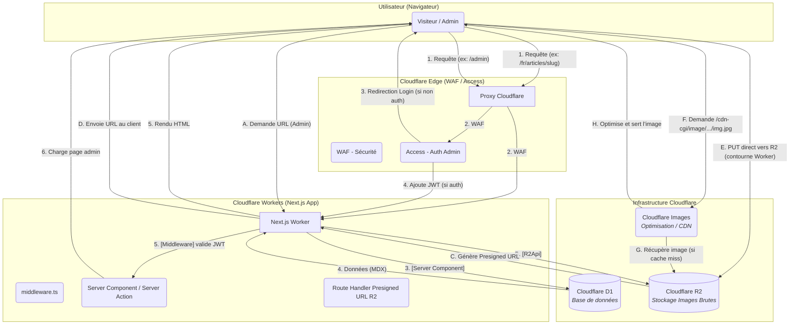
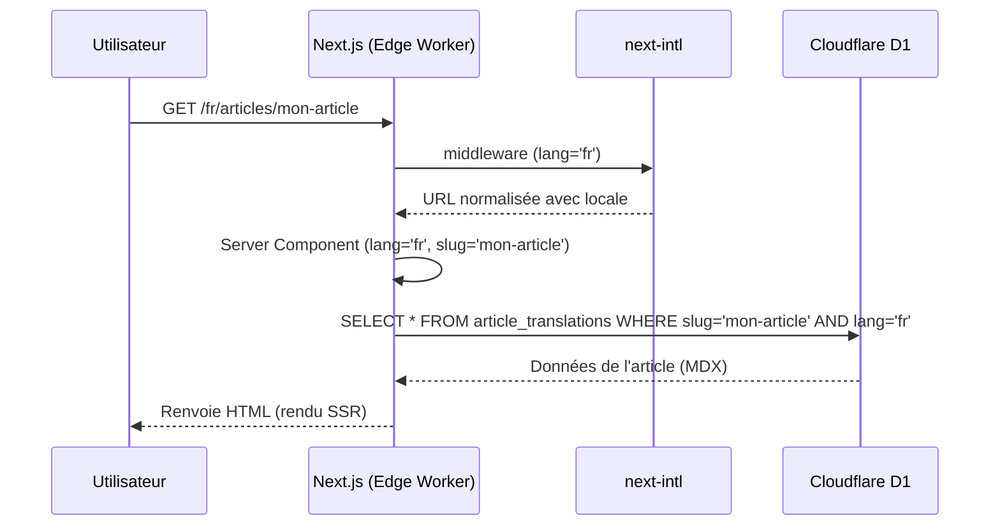
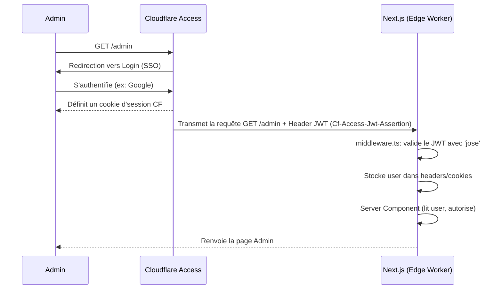
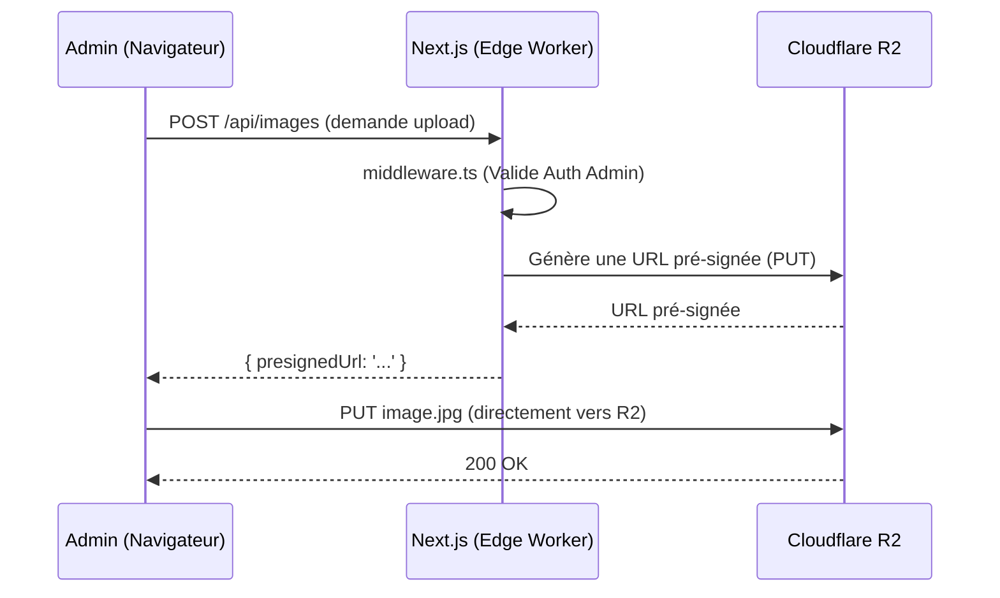

# Document d'Architecture Full-Stack : sebc.dev

## Introduction

Ce document définit l'architecture technique complète (full-stack) du projet `sebc.dev`. Il sert de source unique de vérité pour guider le développement, en assurant la cohérence entre le frontend, le backend, la base de données et l'infrastructure.

Le projet est un blog technique bilingue (FR/EN) moderne, construit sur une stack Next.js 15 et Cloudflare, conçu pour une performance "edge-first" et une maintenabilité à long terme.

### Modèle de Démarrage

L'architecture Next.js 15 déployée sur Cloudflare Workers utilise **@opennextjs/cloudflare** (adaptateur OpenNext).

Configuration requise :

  * **Adaptateur OpenNext** : `@opennextjs/cloudflare` pour transformer l'application Next.js en Worker Cloudflare
  * Configuration de `wrangler.toml` avec bindings pour D1, R2, KV, Durable Objects
  * Flag `nodejs_compat` obligatoire dans wrangler.toml pour compatibilité Node.js
  * Note: L'ancien adaptateur `@cloudflare/next-on-pages` est obsolète et archivé

## Architecture de Haut Niveau

### Résumé Technique

`sebc.dev` est une application Next.js 15 full-stack, monolithique et "serverless", déployée sur **Cloudflare Workers**.

L'architecture s'articule autour des principes suivants :

  * **Frontend (UI)** : Rendu par Next.js 15 avec React Server Components et stylisé avec **TailwindCSS 4** et **shadcn/ui**.
  * **Backend (Logique)** : Géré par les **Next.js Server Actions** et **React Server Components** s'exécutant sur Cloudflare Workers.
  * **Base de Données** : **Cloudflare D1** (SQLite serverless), requêtée via l'ORM **Drizzle**.
  * **Stockage Média** : **Cloudflare R2** pour les images, avec optimisation via **Cloudflare Images**.
  * **Internationalisation (i18n)** : Gérée par **next-intl** pour le routage bilingue (`/fr`, `/en`) avec support complet App Router et RSC.
  * **Authentification (Admin)** : Sécurisée en V1 par **Cloudflare Access** (Zero Trust).

### Plateforme et Infrastructure

La plateforme unique est **Cloudflare**. Cette approche "edge-first" élimine la gestion d'infrastructure traditionnelle (VPS, Docker, pare-feu).

  * **Plateforme** : Cloudflare Workers.
  * **Services Clés (V1)** :
      * **Cloudflare Workers** : Runtime pour l'application Next.js.
      * **Cloudflare D1** : Base de données primaire.
      * **Cloudflare R2** : Stockage des images brutes.
      * **Cloudflare Images** : Optimisation et transformation des images à la volée.
      * **Cloudflare Access** : Sécurisation Zero Trust de la route `/admin`.
      * **Cloudflare WAF** : Protection contre les menaces web (XSS, SQLi).
      * **Cloudflare Web Analytics** : Suivi analytique V1.

### Structure du Répertoire

Le projet adopte une structure **Next.js App Router standard**. Il s'agit d'une application unique Next.js co-localisant le frontend et le backend, avec le panneau d'administration intégré.

### Diagramme d'Architecture

Voici la visualisation du flux système complet pour `sebc.dev` :

### Patterns Architecturaux

  * **Full-stack Serverless** : L'application Next.js s'exécute en tant que Worker Cloudflare.
  * **Composants UI** : Approche basée sur React Server Components et shadcn/ui (composants "copy-paste").
  * **Server Components First** : React Server Components préparent les données côté serveur pour les vues.
  * **ORM (Drizzle)** : Utilisation de Drizzle pour abstraire les requêtes D1 de manière type-safe.
  * **Validation de Bout en Bout** : Chaîne de validation `Drizzle Schema` → `drizzle-zod` → `Zod` → `react-hook-form` pour les Server Actions.
  * **Authentification Zero Trust** : Cloudflare Access gère l'authentification admin ; Next.js ne fait que *valider* le JWT fourni.

-----

## Stack Technique (V1)

Voici la source de vérité unique pour les technologies et versions du projet.

| Catégorie | Technologie | Version | Rôle |
| :--- | :--- | :--- | :--- |
| **Framework** | Next.js | 15.0+ | Framework full-stack avec App Router |
| **Langage UI** | React | 19+ | Bibliothèque d'interface (Server/Client Components) |
| **Backend** | Next.js (Server) | 15.0+ | Server Actions, Server Components, Route Handlers |
| **Adaptateur** | @opennextjs/cloudflare | latest | Transformation Next.js vers Workers |
| **Runtime** | Cloudflare Workers | latest | Exécution Serverless |
| **Base de Données** | Cloudflare D1 | N/A | Stockage (Articles, Taxonomie) |
| **ORM** | Drizzle ORM | latest | Accès base de données type-safe |
| **Stockage Fichiers** | Cloudflare R2 | N/A | Stockage images brutes |
| **Optim. Images** | Cloudflare Images | N/A | Transformation et CDN |
| **Styling** | TailwindCSS | 4.0+ | Framework CSS Utility-first |
| **Composants UI** | shadcn/ui | latest | Bibliothèque de composants accessibles |
| **i18n** | next-intl | latest | Routage et traductions (typesafe, RSC compatible) |
| **Contenu** | MDX | latest | Rendu Markdown + composants React |
| **Auth Admin (V1)** | Cloudflare Access | N/A | Sécurisation Zero Trust |
| **Validation** | Zod + react-hook-form | latest | Validation des formulaires |
| **Tests (Composant)** | Vitest + @testing-library/react | latest | Tests de composants React |
| **Tests (E2E)** | Playwright | latest | Tests End-to-End avec fixtures DB |
| **Déploiement** | GitHub Actions | v4 | CI/CD |

-----

## 4\. Modèles de Données (Logique)

Conformément à la contrainte de ne pas inclure de code, voici la description en prose des entités de données. Le schéma Drizzle sera directement basé sur cette logique.

  * **`articles` (Article)** : Entité centrale contenant les métadonnées partagées par les deux langues.
      * Champs clés : ID, Catégorie (relation), Complexité (`beginner`, `intermediate`, `advanced`), Statut (`draft`, `published`), Date de publication, Image de couverture (lien R2).
  * **`article_translations` (Traduction d'Article)** : Table relationnelle (1-N avec `articles`) contenant le contenu spécifique à une langue.
      * Champs clés : ID, Article ID (relation), Langue (`fr`, `en`), Titre, Slug, Extrait (pour SEO), Contenu MDsveX.
      * *Note (EF23)* : Un article ne peut être publié que si les deux traductions (FR et EN) sont complètes.
  * **`categories` (Catégorie)** : Les 9 catégories canoniques prédéfinies.
      * Champs clés : ID (ex: `news`), Nom (FR/EN), Slug (FR/EN), Icône, Couleur (pour l'UI).
  * **`tags` (Tag)** : Taxonomie flexible gérée par l'admin.
      * Champs clés : ID, Nom (FR/EN).
  * **`articleTags` (Jointure)** : Table de jointure Many-to-Many entre `articles` et `tags`.

-----

## Spécification des APIs

L'application n'expose pas d'API de contenu publique (les données sont chargées via React Server Components). Cependant, elle utilise des Route Handlers (`route.ts`) pour des tâches spécifiques :

  * **`GET /api/health/route.ts`** : Endpoint public pour les Health Checks de Cloudflare. Vérifie la connectivité à D1 et retourne un JSON `{ status: 'ok' }`.
  * **`GET /api/articles/route.ts`** : Endpoint JSON pour le Hub de Recherche (utilisé si le filtrage côté client est privilégié, bien que V1 favorise Server Components pour SSR).
  * **`POST /api/images/route.ts` (Protégé Admin)** : Endpoint sécurisé qui génère et retourne une URL pré-signée Cloudflare R2, permettant au client d'uploader une image directement vers R2.
  * **`GET /sitemap.xml/route.ts`** : Endpoint public qui génère dynamiquement le sitemap XML en requêtant la table `articles` (status `published`) dans D1.

-----

## Composants Logiques

L'architecture est décomposée en services logiques hébergés sur la plateforme Cloudflare:

  * **Application Web (Worker Next.js)** : Le composant principal. Gère le routage, le rendu (SSR/SSG), l'exécution de la logique métier (Server Actions), la validation (Zod) et la coordination des autres services.
  * **Service d'Authentification (Cloudflare Access)** : Proxy externe gérant l'authentification Zero Trust pour la route `/admin`.
  * **Service de Validation (Next.js Middleware)** : Intercepte les requêtes admin, valide le JWT `Cf-Access-Jwt-Assertion` en utilisant `jose` dans `middleware.ts`.
  * **Service de Base de Données (Cloudflare D1)** : Stockage des données textuelles et métadonnées.
  * **Service de Stockage (Cloudflare R2)** : Stockage des objets binaires (images brutes).
  * **Service d'Images (Cloudflare Images)** : Service Edge pour la transformation et la mise en cache des images.

-----

## APIs Externes (V1)

Pour la V1, le projet est entièrement autonome sur l'infrastructure Cloudflare et ne dépend d'aucune API tierce critique pour son fonctionnement.

*Note : Cloudflare Email Service (pour les emails Post-V1) sera utilisé via binding natif Workers*.

-----

## Flux de Travail Principaux (Workflows)

Voici les flux de données et d'interaction clés, visualisés (les diagrammes ne sont pas du code).

### Flux de Lecture (Utilisateur Public)

Ce flux décrit comment un visiteur lit un article, en incluant l'i18n.

### Flux d'Authentification (Admin)

Ce flux utilise le modèle Zero Trust de Cloudflare Access.

### Flux d'Upload d'Image (Admin)

Ce flux utilise des URLs pré-signées pour contourner les limites du Worker.

-----

## Architecture Frontend

L'architecture frontend est détaillée dans `Frontend_Specification.md`, mais les points clés sont résumés ici:

  * **Structure des Composants** : Les composants sont organisés par fonctionnalité (`features`), par disposition (`layout`) et par éléments réutilisables (`ui` - basés sur shadcn/ui).
  * **Gestion d'État (State Management)** :
      * **État local/composant** : React hooks (`useState`, `useReducer`) pour Client Components.
      * **État global (Client)** : React Context ou Zustand pour état partagé côté client.
      * **État Serveur** : React Server Components récupèrent les données côté serveur sans état client.
      * **État des Filtres (Hub)** : L'URL (`URLSearchParams`) est la source de vérité, gérée via `useRouter()` et lue via Server Components.
  * **Routage** : Géré par Next.js App Router (système de fichiers) avec middleware next-intl pour l'i18n.

-----

## Architecture Backend

L'architecture backend est entièrement "serverless", intégrée à Next.js et s'exécutant sur Cloudflare Workers.

  * **Architecture de Service** : Logique métier co-localisée avec les routes :
      * **Server Components** (async components) pour pré-chargement de données dans les pages.
      * **Server Actions** (fonctions async) pour mutations et traitement de formulaires.
      * **Route Handlers** (`route.ts`) pour API endpoints JSON ou tâches spécifiques (ex: upload).
  * **Couche d'Accès aux Données** : Centralisée via Drizzle ORM. Les requêtes sont écrites dans `src/lib/server/db/` et appelées depuis Server Components ou Server Actions.
  * **Authentification** : Gérée par Cloudflare Access. La logique applicative se limite à la *validation* du JWT dans `middleware.ts`.

-----

## Structure Unifiée du Projet

La structure des fichiers (décrite en prose, sans code) est définie dans `Frontend_Specification.md`. Les répertoires clés sont :

  * **`app/`** : Contient toutes les pages, layouts, et Route Handlers. C'est le cœur de l'application Next.js App Router.
  * **`src/components/`** : Contient tous les composants React, organisés par `layout`, `features`, et `ui` (shadcn/ui).
  * **`src/lib/`** : Code partagé entre serveur et client (utilitaires, helpers).
  * **`src/lib/server/`** : Code *exclusivement* serveur (ex: logique Drizzle, validation auth).
  * **`messages/`** (à la racine) : Fichiers `fr.json` et `en.json` pour next-intl.
  * **`tests/`** (à la racine) : Contient les tests unitaires (Vitest) et E2E (Playwright).

-----

## Flux de Développement

  * **Démarrage** : `wrangler dev -- npx next dev` lance le serveur avec HMR et accès aux bindings locaux (`.dev.vars`, D1 local, R2 local).
  * **Source de Vérité (Env)** : Les secrets et bindings côté serveur sont accessibles via les bindings Cloudflare configurés dans `wrangler.toml`.
  * **Migrations DB** : Processus en deux étapes :
    1.  `pnpm db:generate` (Drizzle Kit génère le SQL).
    2.  `pnpm db:migrate:local` (Wrangler applique le SQL à D1 local).

-----

## Architecture de Déploiement

  * **Plateforme** : Cloudflare (Workers).
  * **CI/CD** : Pipeline GitHub Actions.
  * **Processus CI/CD (Obligatoire)** : Le pipeline doit exécuter les étapes suivantes dans l'ordre :
    1.  Installation des dépendances (`pnpm install`).
    2.  Lint & Type-check (`pnpm lint`).
    3.  Tests (`pnpm test` - Vitest, Playwright).
    4.  Build de l'application (`pnpm build`).
    5.  **Étape 1 Déploiement :** Migration de la base de données (`wrangler d1 migrations apply DB --remote`).
    6.  **Étape 2 Déploiement :** Déploiement du code Worker (`wrangler deploy`).

-----

## Sécurité et Performance

### Sécurité

  * **Authentification Admin** : Cloudflare Access (Zero Trust).
  * **Protection Réseau** : Cloudflare WAF (XSS, SQLi).
  * **CSRF** : Protection native de Next.js (vérification de l'origine) activée pour Server Actions.
  * **Validation des Entrées** : Validation Zod/react-hook-form côté serveur sur *toutes* les Server Actions.

### Performance

  * **Runtime** : Exécution à l'Edge (Cloudflare Workers) pour une latence minimale.
  * **Images** : Optimisation à la volée via Cloudflare Images avec loader personnalisé next/image.
  * **Cache (V1)** : Architecture OpenNext avec R2 (cache incrémental), Durable Objects (ISR), D1 (tag cache), et KV.
  * **Code** : Bundles optimisés et code-splitting par route (natif à Next.js App Router).
  * **Objectifs V1** : LCP < 2.5s, INP < 100ms, CLS < 0.1.

-----

## Stratégie de Test

La stratégie de test est conçue pour une haute fidélité :

  * **Tests Unitaires** : `Vitest` pour la logique métier pure (ex: `src/lib/utils`).
  * **Tests de Composants** : **`Vitest + @testing-library/react`**. Les tests s'exécutent avec des utilitaires React Testing Library pour valider le comportement des composants.
  * **Tests E2E (End-to-End)** : **`Playwright`**. Les tests E2E utiliseront des *fixtures de base de données* pour ensemencer (seed) et réinitialiser (reset) la base D1 locale avant chaque test via `wrangler d1 execute DB --local --file=./seed.sql`, assurant l'isolation.

-----

## Monitoring et Observabilité (V1)

  * **Monitoring de Santé** : **Cloudflare Health Checks** configurés pour interroger l'endpoint `GET /health`.
  * **Métriques de Performance** : **Workers Metrics** et **Workers Logs** via le tableau de bord Cloudflare.
  * **Observabilité** : Logs structurés JSON activés via `[observability]` dans wrangler.toml avec `enabled = true` et `head_sampling_rate = 1.0`.
  * **Analytics (Utilisateur)** : **Cloudflare Web Analytics** (privacy-first).
  * **Sauvegardes** : **Cloudflare D1 Time Travel** (Point-in-Time Recovery sur 30 jours).