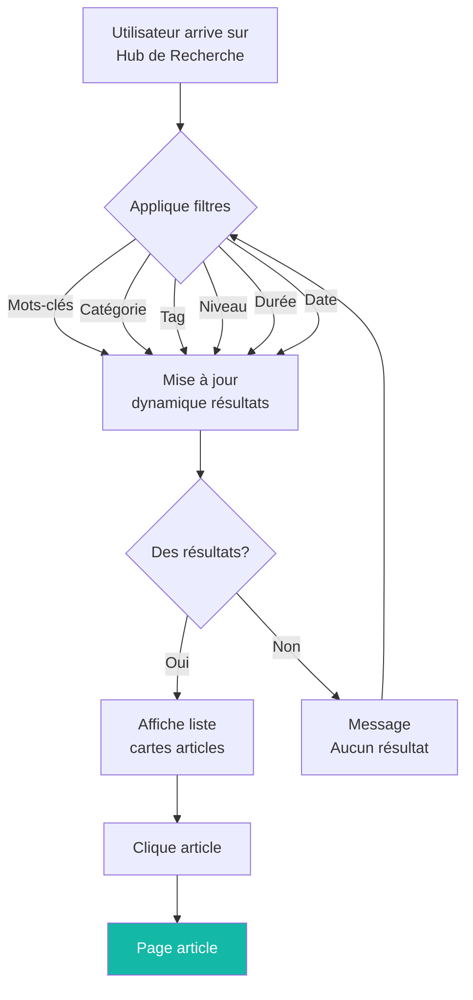
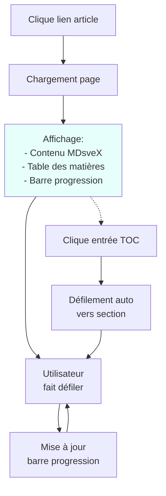
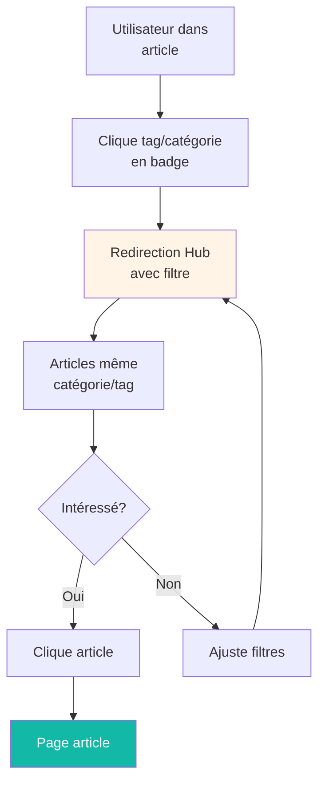

# UX/UI Specification — sebc.dev V1
## Adaptation pour SvelteKit 5 + Cloudflare Stack

---

## 1. Introduction

Ce document définit les objectifs UX, l'architecture de l'information, les parcours utilisateurs et les spécifications de conception visuelle pour **sebc.dev V1**.

**sebc.dev** est un blog technique bilingue (FR/EN) construit sur **SvelteKit 5 + Cloudflare Workers**, explorant l'intersection de l'IA, l'UX et l'ingénierie logicielle. Cette spécification établit les fondations pour une expérience utilisateur centrée sur l'efficacité, la clarté et l'accessibilité, dès le départ.

---

## 2. Objectifs et Principes UX Généraux

### 2.1 Personas Cibles

- **Développeurs mid-level en startup**
  - Cherchent une efficacité maximale avec accès rapide aux solutions
  - Objectif : **time-to-value < 60 secondes**
  - Cas d'usage : résoudre un problème technique, trouver une approche UX/IA applicable immédiatement

- **Juniors en apprentissage**
  - Ont besoin de guidance progressive et parcours structurés
  - Objectif : **pattern discovery < 3 minutes**
  - Cas d'usage : apprendre des patterns, comprendre des concepts progressivement

- **Indie hackers/freelances**
  - Recherchent une vue d'ensemble stratégique et ROI clair
  - Priorité : réductions friction cognitive, accès direct aux best practices
  - Cas d'usage : benchmark d'outils, décisions architecturales

### 2.2 Objectifs d'Utilisabilité

- **Apprentissage Facile** : Nouveaux utilisateurs accomplissent les tâches principales en < 5 min
- **Efficacité d'Utilisation** : Utilisateurs expérimentés trouvent contenu pertinent en < 60s
- **Prévention des Erreurs** : Navigation claire, pas de dead-ends
- **Mémorabilité** : Interface cohérente, patterns visuels répétables
- **Accessibilité** : WCAG 2.1 AA natif (obligatoire en V1)

### 2.3 Principes de Conception

1. **Clarté avant tout** : Hiérarchie visuelle stricte, communication précise
2. **Divulgation Progressive** : Ne montrer que nécessaire, au moment opportun
3. **Cohérence des Patterns** : Composants shadcn-svelte homogènes
4. **Feedback Immédiat** : Chaque action utilisateur → réponse système visible
5. **Accessibilité par Défaut** : Navigation clavier, lecteurs d'écran, WCAG AA

---

## 3. Architecture de l'Information (IA)

### 3.1 Structure Logique

L'objectif est de permettre découverte rapide en accord avec :
- **time-to-value < 60s** pour accès direct aux solutions
- **pattern discovery < 3min** pour apprenants progressifs

```
┌─────────────────────────────────────────┐
│              Accueil (Home)              │
│  - Hero section + articles en vedette  │
│  - Appels à l'action (Blog, Catégories) │
└──────────────────┬──────────────────────┘
                   │
        ┌──────────┼──────────┐
        │          │          │
    ┌───▼──┐  ┌───▼───┐  ┌───▼─────┐
    │ Blog │  │ Catégories │  │ Niveaux  │
    │(Hub) │  │ (Filtres)  │  │(Filtres) │
    └───┬──┘  └───┬───┘  └───┬─────┘
        │         │          │
        └────┬────┴────┬─────┘
             │         │
         ┌───▼─────────▼────┐
         │  HUB RECHERCHE  │
         │  (Point Central) │
         │  - Filtres multi │
         │  - Résultats     │
         │  - Pagination    │
         └───┬──────────────┘
             │
         ┌───▼────────┐
         │   Article  │
         │ (Lecture)  │
         └────────────┘
```

**Flux principal** :
1. Utilisateur arrive sur **Accueil** (`/fr/` ou `/en/`)
2. Clique sur **"Blog"** → **Hub de Recherche** (`/fr/articles`) OU
   - Clique sur **"Catégories"** → Redirect **Hub de Recherche** avec filtre `?category=X`  OU
   - Clique sur **"Niveaux"** → Redirect **Hub de Recherche** (interface affiche filtres par niveau)
3. Sur **Hub de Recherche**, utilise **filtres combinés** (mots-clés, catégories, tags, complexité, durée, date)
4. Clique sur **article card** → **Page de lecture** avec TOC + barre de progression
5. Sur **page article**, clique badge catégorie/tag → Redirect **Hub de Recherche** avec filtre appliqué

### 3.2 Architecture Centralisée : Hub de Recherche comme Point Central

**Le Hub de Recherche est le point central unique** pour la découverte et navigation d'articles en V1.

Toutes les taxonomies (catégories, tags, niveaux) sont des **points d'entrée directs qui redirigent vers le Hub** avec filtres pré-appliqués :

**Points d'entrée vers le Hub** :
- **Navigation Catégories** → Clique catégorie → Redirect `/fr/articles?category=X`
- **Navigation Niveaux** → Clique niveau → Redirect `/fr/articles?complexity=beginner|intermediate|advanced`
- **Article** → Clique badge catégorie/tag → Redirect `/fr/articles?category=X` ou `/fr/articles?tags=Y`
- **Recherche textuelle** → Hub avec `q=...` en URL Search Params
- **Lien direct "Voir tous les articles"** → `/fr/articles` (Hub sans filtres)

**Pages de taxonomie en V1** : Les pages `/fr/categories` et `/fr/levels` n'existent **pas comme pages de contenu indépendantes**. Les navigations "Catégories" et "Niveaux" redirigent directement vers le Hub avec UI pour visualiser les options de filtrage.

### 3.3 Plan du Site (V1)

```
Domaine (sebc.dev)
├─ /fr (français, par défaut)
│  ├─ / (Accueil)
│  ├─ /articles (Hub de Recherche - point central)
│  │  ├─ ?category=X (articles filtrés par catégorie)
│  │  ├─ ?complexity=X (articles filtrés par niveau)
│  │  ├─ ?tags=Y (articles filtrés par tags)
│  │  ├─ ?q=... (articles filtrés par mots-clés)
│  │  ├─ Combinaisons multiples (AND logique)
│  │  │
│  │  └─ /articles/[slug] (Page article unique)
│  │
│  └─ /admin (Panneau d'administration - protégé Cloudflare Access)
│     ├─ /admin/articles (CRUD articles)
│     ├─ /admin/articles/new (Création article)
│     ├─ /admin/articles/[id] (Édition article)
│     ├─ /admin/categories (Gestion catégories)
│     └─ /admin/tags (Gestion tags)
│
├─ /en (anglais)
│  ├─ / (Accueil)
│  ├─ /articles (Hub de Recherche - point central)
│  │  ├─ ?category=X
│  │  ├─ ?complexity=X
│  │  ├─ ?tags=Y
│  │  ├─ ?q=...
│  │  │
│  │  └─ /articles/[slug] (Page article unique)
│  │
│  └─ /admin (même protection)
│
├─ /api/articles (API Endpoint - recherche articles JSON)
├─ /sitemap.xml (généré dynamiquement D1 query)
├─ /robots.txt (statique)
└─ /health (monitoring Cloudflare Health Checks)

Post-V1 :
├─ /wiki (ressources dev)
├─ /newsletter (abonnement)
└─ /account (profil utilisateur)

Note : Les pages `/categories` et `/levels` n'existent pas en V1.
Navigation vers ces points redirige vers `/articles` avec filtres pré-appliqués.
```

### 3.4 Gestion du Contexte d'Utilisation

L'interface s'adapte dynamiquement au **contexte** :

- **Utilisateur accède par lien direct** : Affiche contenu immédiatement
- **Utilisateur arrive du Hub de Recherche** : Fil d'Ariane reflète les filtres appliqués
- **Utilisateur clique tag/catégorie** : Retour Hub avec filtre pré-appliqué
- **Utilisateur en lecture** : Table des matières + indicateur progression toujours accessible

---

## 4. Navigation et Fil d'Ariane

### 4.1 Navigation Principale (Header)

Minimaliste, toujours visible, adaptée mobile-first :

```
┌────────────────────────────────────────┐
│ [Logo] │ Articles │ Catégories │ Niveaux │ [🌐 FR/EN] │
└────────────────────────────────────────┘
```

- **Logo** : Lien vers `/[lang]/` (accueil)
- **Articles** : Lien vers `/[lang]/articles` (Hub de Recherche)
- **Catégories** : Menu déroulant → clique catégorie → Hub avec filtre `category=X`
- **Niveaux** : Menu déroulant → clique niveau → Hub avec filtre `complexity=X`
- **Sélecteur langue** : FR/EN avec persistance cookie (Paraglide-JS)

### 4.2 Fil d'Ariane (Breadcrumbs)

S'affiche sous la navigation, reflète le contexte de filtrage :

- Page accueil : _Rien_
- Hub de Recherche : `Accueil > Articles`
- Hub avec filtre : `Accueil > Articles (Catégorie: Tutoriel) > Résultats`
- Page article : `Accueil > Articles > [Titre Article]`
- Admin : `Accueil > Admin > [Section]`

### 4.3 Contexte Multilingue

Toutes les URLs sont préfixées `/fr` ou `/en` :
- Détection automatique via `Accept-Language` (cookie override)
- Paraglide-JS gère le `reroute` hook pour routing
- Balises `hreflang` pour SEO
- Badge de langue si contenu partiellement traduit

---

## 5. Parcours Utilisateurs (User Flows)

### 5.1 Flux 1 : Recherche et Filtrage d'Articles

**Objectif** : Trouver rapidement articles pertinents via combinaison filtres
**Temps cible** : < 60 secondes



**Critères de succès** :
- Filtres s'appliquent sans rechargement de page (URL Search Params)
- Résultats mis à jour instantanément via load function SvelteKit
- URL reste partageable (`/fr/articles?category=tutorial&level=beginner`)
- Empty state avec suggestions de critères moins restrictifs

### 5.2 Flux 2 : Lecture d'un Article

**Objectif** : Lire confortablement avec navigation facile + progression visible
**Temps cible** : indicateur utile pour sessions > 5 min



**Critères de succès** :
- TOC cliquable → défilement vers section (smooth scroll)
- Barre progression mise à jour au scroll
- Temps de lecture global + par section visibles
- Métadonnées article (catégorie, tags, date, auteur) toujours accessibles
- Lien vers articles connexes (même catégorie/tags) en bas

### 5.3 Flux 3 : Navigation par Taxonomie

**Objectif** : Découvrir contenu par catégorie/tag
**Temps cible** : < 3 minutes pour pattern discovery



---

## 6. Structure Responsive

### 6.1 Points de Rupture (Breakpoints)

Utilisation TailwindCSS 4 standard :

| Breakpoint | Min Width | Appareils |
|---|---|---|
| **Mobile (sm)** | 0px | Smartphones portrait/paysage |
| **Tablette (md)** | 768px | Tablettes portrait/paysage |
| **Desktop (lg)** | 1024px | Ordinateurs portables, bureaux |
| **Wide (xl)** | 1280px | Grands moniteurs |

### 6.2 Layout par Point de Rupture

#### Hub de Recherche

**Mobile (< 768px)**
```
┌─────────────────┐
│  [Filtr] [🔍]   │  ← Bouton "Filtrer" + Recherche
├─────────────────┤
│   [📦] Article  │  ← Cartes une colonne
│   [📦] Article  │
│   [📦] Article  │
└─────────────────┘
```
- Bouton "Filtrer" ouvre **Sheet** (panneau latéral mobile)
- Recherche par mots-clés en haut
- Cartes une seule colonne

**Tablette (768px - 1024px)**
```
┌──────┬──────────────┐
│      │  [Filtr] [🔍]│
│      ├──────────────┤
│      │ [📦] [📦]    │
│Filtres│ [📦] [📦]   │
│(side) │ [📦] [📦]   │
│sticky │              │
└──────┴──────────────┘
```
- Panneau filtres **sticky** à gauche
- Cartes deux colonnes
- Hauteur de viewport constante

**Desktop (≥ 1024px)**
```
┌──────┬──────────────────┐
│      │  [Filtr] [🔍]    │
│      ├──────────────────┤
│      │ [📦] [📦] [📦]  │
│Filtres│ [📦] [📦] [📦] │
│(side) │ [📦] [📦] [📦] │
│sticky │                 │
└──────┴──────────────────┘
```
- Panneau filtres **sticky** à gauche
- Cartes trois colonnes
- Marges latérales élargies (max-width container)

#### Page Article

**Mobile (< 768px)**
```
┌─────────────────┐
│  [🔖] TOC modal │  ← Bouton TOC ouvre modal
├─────────────────┤
│ ▮▮▮▮▯▯▯▯▯▯▯▯▯  │  ← Barre progression (sticky top)
├─────────────────┤
│                 │
│   Contenu MDsveX│
│   Une colonne   │
│                 │
└─────────────────┘
```
- TOC : bouton → modal (overlay)
- Barre progression sticky en haut
- Contenu une colonne (max-width 800px recommandé)

**Tablette (768px - 1024px)**
```
┌──────┬──────────────┐
│      │ ▮▮▮▯▯▯▯▯▯▯▯  │  ← Barre progression sticky
│      ├──────────────┤
│      │              │
│  TOC │   Contenu    │
│ sticky│   MDsveX    │
│(right)│              │
└──────┴──────────────┘
```
- TOC : bouton → modal (tablettes < 1024px)
- Barre progression sticky top
- Contenu centré avec marges

**Desktop (≥ 1024px)**
```
┌─────────────┬──────────────┬─────────────┐
│             │ ▮▮▮▯▯▯▯▯▯▯▯  │             │  ← Progression sticky
│   (Vide)    ├──────────────┤   TOC       │
│             │              │   sticky    │
│             │   Contenu    │  (right)    │
│             │   MDsveX     │             │
│             │              │             │
└─────────────┴──────────────┴─────────────┘
```
- Contenu centré, colonne unique (max-width 700px lecture optimale)
- TOC **sticky** à droite (visible en permanence)
- Barre progression sticky top

### 6.3 Adaptation Composants

**Boutons et zones interactives**
- Mobile : minimum 44x44px (norme tactile WCAG)
- Desktop : hover states visibles, focus ring clairs

**Images**
- Mobile : fullwidth
- Desktop : centrage + max-width 800px

**Tableau de matières**
- Mobile : modal/Sheet (ne pas encombrer viewport)
- Desktop : sidebar sticky (visible permanent)

---

## 7. Système de Design (Design System)

### 7.1 Palette de Couleurs

Basée sur **dark mode moderne**, avec accent vert canard :

| Type | Hex | Utilisation |
|---|---|---|
| **Fond Primaire** | `#1A1D23` | Arrière-plan principal (anthracite profond) |
| **Fond Secondaire** | `#2D3748` | Cartes, panneaux, sections |
| **Accent Principal** | `#14B8A6` | Liens, boutons, indicateurs actifs (vert canard) |
| **Texte Principal** | `#F7FAFC` | Titres, corps (blanc cassé) |
| **Texte Secondaire** | `#A0AEC0` | Métadonnées, hints (gris moyen) |
| **Erreur** | `#F56565` | Messages d'erreur, actions destructives (rouge) |
| **Succès** | `#48BB78` | Confirmations (vert) |

### 7.2 Typographie

| Élément | Taille | Graisse | Hauteur Ligne | Famille |
|---|---|---|---|---|
| **H1** | 2.25rem (36px) | 700 | 1.2 | Nunito Sans |
| **H2** | 1.875rem (30px) | 700 | 1.2 | Nunito Sans |
| **H3** | 1.5rem (24px) | 600 | 1.3 | Nunito Sans |
| **Corps** | 1rem (16px) | 400 | 1.6 | Nunito Sans |
| **Petit** | 0.875rem (14px) | 400 | 1.5 | Nunito Sans |
| **Code** | 0.875rem (14px) | 400 | 1.6 | JetBrains Mono |

**Polices**
- **Nunito Sans** : Corps + titres (lisibilité, formes arrondies amicales)
- **JetBrains Mono** : Code (monospace, familiarité développeurs)

### 7.3 Iconographie

- **Bibliothèque** : Lucide Icons (léger, cohérent, SVG natif)
- **Catégories** : Icône unique par catégorie (identification visuelle immédiate)
- **États** : icônes pour actif/inactif/loading

Exemple 9 catégories :
- Actualités → 📰 (news-icon)
- Analyse Approfondie → 🔬 (microscope-icon)
- Parcours d'Apprentissage → 🛤️ (journey-icon)
- Rétrospective → 📋 (clipboard-icon)
- Tutoriel → 🎓 (graduation-icon)
- Étude de Cas → 📊 (bar-chart-icon)
- Astuces Rapides → ⚡ (flash-icon)
- Dans les Coulisses → 🎬 (camera-icon)
- Test d'Outil → 🧪 (test-tube-icon)

### 7.4 Espacement et Grille

- **Grille** : 12 colonnes (TailwindCSS standard)
- **Espacement** : Multiples de 8px (8, 16, 24, 32, 48, 64, etc.)
- **Marges conteneur** :
  - Mobile : 16px (1rem)
  - Tablette : 24px (1.5rem)
  - Desktop : 32px (2rem)

### 7.5 Composants shadcn-svelte

**Utilisation complète** :

- **Button** : Variantes `primary` (accent), `secondary`, `ghost`, `link`
- **Card** : Conteneurs articles, résultats
- **Badge** : Catégories, tags, niveaux de complexité
- **Input** : Recherche, filtres texte
- **Sheet** : Panneau filtres mobile
- **Dialog/Modal** : Confirmations, TOC mobile
- **Progress** : Barre progression lecture
- **Tooltip** : Infos supplémentaires hover
- **Pagination** : Navigation résultats (24 par page)
- **Select** : Dropdowns catégories/niveaux

---

## 8. Componentes Clés Implémentés

### 8.1 Composant ArticleCard

Affichage homogène dans toutes les listes (Hub, catégories, articles connexes) :

```svelte
<ArticleCard
  title="Article Title"
  excerpt="Short excerpt..."
  category="Tutorial"
  tags={['tag1', 'tag2']}
  complexity="intermediate"
  readingTime={8}
  publishedAt={new Date()}
  slug="article-slug"
  lang="fr"
/>
```

**Affichage** :
```
┌──────────────────┐
│ [Icône] Tutoriel │ ← Catégorie + badge couleur
├──────────────────┤
│ Titre Article    │ ← H3 bold
│ ..description    │ ← Corps secondaire
├──────────────────┤
│ [tag] [tag]      │ ← Tags clickables
│ Intermédiaire    │ ← Badge niveau
│ 8 min • 2 jours  │ ← Métadonnées
└──────────────────┘
```

### 8.2 Composant TableOfContents

Auto-généré depuis headings MDsveX, cliquable, avec temps de lecture par section :

```svelte
<TableOfContents
  headings={[
    { id: 'intro', text: 'Introduction', level: 2, readingTime: 2 },
    { id: 'concept', text: 'Le Concept', level: 2, readingTime: 5 },
    { id: 'impl', text: 'Implémentation', level: 2, readingTime: 12 },
  ]}
/>
```

**Affichage** :
```
Table des Matières
─────────────────
▸ Introduction (2 min)
▸ Le Concept (5 min)
  ▾ Implémentation (12 min)
    • Étape 1 (3 min)
    • Étape 2 (4 min)
```

### 8.3 Composant ReadingProgressBar

Barre de progression sticky top, mise à jour au scroll :

```svelte
<ReadingProgressBar progress={45} />
```

Affiche progression visuelle (0-100%) via largeur bar, couleur accent (#14B8A6).

### 8.4 Composant ComplexityBadge

Badge avec icône et label, traductions via Paraglide :

```svelte
<ComplexityBadge level="intermediate" />
```

Variantes :
- Débutant → icône 📗 + label "Débutant" (vert)
- Intermédiaire → icône 📕 + label "Intermédiaire" (orange)
- Avancé → icône 📘 + label "Avancé" (rouge)

### 8.5 Composant SearchFilters

Filtres combinables pour Hub de Recherche :

```svelte
<SearchFilters
  categories={categories}
  tags={tags}
  levels={['beginner', 'intermediate', 'advanced']}
  onFilterChange={handleFilterChange}
/>
```

---

## 9. Animations & Micro-interactions

### 9.1 Principes de Mouvement

1. **Subtilité** : Animations rapides (200-300ms), discrètes
2. **Feedback** : Confirmation actions utilisateur (hover, focus, click)
3. **Performance** : Transform + opacity uniquement (pas de layout shift)
4. **Respect prefers-reduced-motion** : Animations désactivées si pref active

### 9.2 Animations Clés

| Interaction | Durée | Easing | Exemple |
|---|---|---|---|
| **Hover boutons** | 200ms | ease-out | Legère translation y: -2px + color fade |
| **Focus outline** | Immédiate | N/A | Ring visible 2px (#14B8A6) |
| **Page transition** | 200ms | ease-in-out | Fade in/out |
| **Loading skeleton** | Pulse | linear | Shimmer effect (background gradient) |
| **Scroll smooth** | 400ms | ease-out | Scroll vers TOC item |
| **Progress bar** | Smooth | linear | Width change fluid |

### 9.3 États Visuels

**Boutons** : default → hover → focus → active → disabled
**Liens** : default → visited → hover → focus → active
**Cartes** : default → hover (shadow lift) → active
**Filtres** : default → selected (background highlight) → hover

---

## 10. Accessibilité (a11y) WCAG 2.1 AA

### 10.1 Exigences Visuelles

- **Contraste** : Minimum 4.5:1 texte/fond (normal), 3:1 (large)
- **Focus indicators** : Ring visible 2px minimum sur tous éléments interactifs
- **Redimensionnement** : Contenu lisible jusqu'à 200% zoom

### 10.2 Interaction

- **Clavier** : Navigation tabulation logique, touches spéciales gérées (Enter, Espace, Arrow)
- **Lecteur écran** : HTML sémantique (landmarks, headings, labels, ARIA)
- **Cibles tactiles** : Minimum 44x44px (avec espacement si < 44px)
- **prefers-reduced-motion** : Animations + transitions désactivées

### 10.3 Contenu

- **Texte alternatif** : Toutes images informatives ont alt descriptif
- **Structure headings** : Hiérarchie logique h1 → h2 → h3 (pas de sauts)
- **Étiquettes formulaire** : `<label>` liée via `for` ou wrapping
- **Messages d'erreur** : Clairs, associés champs, suggérant correction

### 10.4 Audit & Tests

- **Lighthouse** : Score accessibilité ≥ 90 (exécution CI/CD)
- **Tests manuels** : Navigation clavier + lecteur écran (nvda/jaws)
- **Validation WAVE** : Pas d'erreurs, warnings examinés

---

## 11. Performance & Core Web Vitals

### 11.1 Objectifs (V1)

- **LCP** (Largest Contentful Paint) : < 2.5s (mobile 4G)
- **INP** (Interaction to Next Paint) : < 100ms
- **CLS** (Cumulative Layout Shift) : < 0.1

### 11.2 Stratégies SvelteKit + Cloudflare

**Frontend**
- Pages servies depuis Edge Cloudflare (latence minimale)
- Bundle optimisé via Vite build (tree-shaking, code-splitting)
- Composants shadcn-svelte légers + Nunito Sans subset
- Lazy loading images par défaut

**Images (Cloudflare R2 + Transform)**
- Stockage R2, transformation à la volée via CDN-cgi
- WebP/AVIF auto (format negotiation)
- Lazy loading + width/height requis (pas de CLS)
- Max 500 Ko source avant transformation

**Cache (Cloudflare)**
- Pages articles : max-age=3600, s-maxage=86400
- API/données : max-age=300
- Admin : no-cache

**Database**
- Drizzle ORM queryoptimization (select columns strictly)
- D1 queries servies depuis Edge
- Indexes sur colonnes filtrage fréquent

---

## 12. Multilingue (i18n) avec Paraglide-JS

### 12.1 Architecture

- **Détection** : URL `/fr` ou `/en` + cookie override + Accept-Language fallback
- **Fichiers messages** : `messages/fr.json`, `messages/en.json` (compilés, tree-shakable)
- **Hook reroute** : `src/hooks.ts` gère `deLocalizeUrl()` de Paraglide
- **Contenu** : MDsveX stocké en D1 avec colonne `language` ('fr' | 'en')

### 12.2 Fallback de Contenu

Si traduction manquante :
1. Affiche version disponible (ex: FR si EN manquante)
2. Badge "Affiché en FR" en haut page
3. Bouton "Voir en Anglais" (link vers EN si dispo)

### 12.3 SEO hreflang & Canonical

```html
<!-- Page FR -->
<link rel="alternate" hreflang="en" href="https://sebc.dev/en/articles/slug" />
<link rel="canonical" href="https://sebc.dev/fr/articles/slug" />

<!-- Page EN -->
<link rel="alternate" hreflang="fr" href="https://sebc.dev/fr/articles/slug" />
<link rel="canonical" href="https://sebc.dev/en/articles/slug" />
```

---

## 13. Gestion d'État et Filtres

### 13.1 URL Search Params

L'état du Hub de Recherche est **persisté dans l'URL** via `URLSearchParams` :

```
/fr/articles?q=svelte&category=tutorial&level=beginner&tags=ui&duration_min=5&duration_max=15&date_from=2025-01-01
```

**Paramètres** :
- `q` : Recherche textuelle (mots-clés)
- `category` : ID catégorie (filtrage mono ou multi)
- `level` : beginner|intermediate|advanced (mono)
- `tags` : IDs tags comma-separated (multi)
- `duration_min`, `duration_max` : minutes
- `date_from`, `date_to` : ISO dates
- `page` : Numéro page (défaut 1)
- `sort` : -date | date | title (défaut -date)

### 13.2 Mise à Jour sans Rechargement

**Flux SvelteKit** :
1. Utilisateur interagit avec filtre
2. URL mise à jour via `goto(newUrl)` (client-side)
3. Load function SvelteKit réexécutée (données pré-chargées serveur)
4. Composants mise à jour via réactivité Svelte 5 (Runes)

```typescript
// src/routes/[lang]/articles/+page.server.ts
export const load = async ({ url, locals }) => {
  const q = url.searchParams.get('q') ?? '';
  const category = url.searchParams.get('category');
  // ... fetch articles with filters
  return { articles, filters, totalCount };
};
```

### 13.3 Facettes Dynamiques

Les options de filtrage (catégories, tags) sont **recalculées** selon résultats actuels :

- Affiche seulement catégories/tags ayant résultats
- Compte résultats par catégorie (badge "15")
- Désactive filtres sans résultats

---

## 14. Admin Panel (Création/Édition Articles)

### 14.1 Workflow

```
┌─────────────────────────────┐
│   Admin / Articles          │
├─────────────────────────────┤
│ [+ Nouvel Article]          │
├─────────────────────────────┤
│ ✏️ Article Title  │ 📅 2025-01-15 │
│ ✏️ Article Title  │ 📅 2025-01-10 │
│ ✏️ Article Title  │ 📅 2025-01-05 │
└─────────────────────────────┘
       ↓ Clique édition
┌─────────────────────────────┐
│   Édition Article           │
├─────────────────────────────┤
│ [FR] [EN]  ← Onglets       │
├─────────────────────────────┤
│ Title: [________________]   │
│ Slug: [________________]    │
│ Category: [Dropdown ↓]     │
│ Tags: [+ Tag selector]     │
│ Level: ◉ Beginner          │
│        ◉ Intermediate      │
│        ◉ Advanced          │
│ Excerpt: [______________]  │
│ Content (MDsveX):          │
│ [Rich Editor / Markdown]   │
│                            │
│ [Preview] [Save Draft]     │
│ [Publish]                  │
└─────────────────────────────┘
```

### 14.2 Validation Publication

Article **ne peut être publié que si** :
- ✅ Titre FR + EN
- ✅ Slug FR + EN
- ✅ Excerpt FR + EN
- ✅ Catégorie assignée
- ✅ Contenu MDsveX FR + EN
- ✅ Niveau complexité défini

Validation via `sveltekit-superforms` + Zod schemas (générés par drizzle-zod) dans Form Actions.

### 14.3 Mode Prévisualisation

Bouton "Prévisualiser" ouvre `/fr/articles/[slug]?preview=true` :
- Affiche article en mode draft (avant publication)
- Protégé par Cloudflare Access (authentification admin)
- Badge "MODE PRÉVISUALISATION" visible
- Accessible seulement à l'auteur (vérification `locals.user`)

---

## 15. SEO & Métadonnées

### 15.1 Meta Tags

Générés dynamiquement dans load functions pour chaque page :

```typescript
// src/routes/[lang]/articles/[slug]/+page.server.ts
export const load = async ({ params, locals, url }) => {
  const article = await locals.db.select().from(articles)...;

  return {
    article,
    metadata: {
      title: article.seoTitle,
      description: article.seoDescription,
      canonical: url.href,
      ogImage: buildCloudflareImageUrl(article.heroImage, { width: 1200 }),
      hreflang: {
        fr: `https://sebc.dev/fr/articles/${article.slug}`,
        en: `https://sebc.dev/en/articles/${article.slug}`
      }
    }
  };
};
```

### 15.2 Sitemap Dynamique

Route `+server.ts` génère sitemap XML :
- Toutes pages publiées
- Priorités : articles récents (1.0), anciens (0.8)
- Fréquences : récents weekly, anciens monthly
- Cache 1 heure

### 15.3 Open Graph & Twitter Cards

```html
<meta property="og:title" content="{metadata.title}" />
<meta property="og:description" content="{metadata.description}" />
<meta property="og:image" content="{metadata.ogImage}" />
<meta property="og:url" content="{metadata.canonical}" />
<meta property="og:type" content="article" />

<meta name="twitter:card" content="summary_large_image" />
<meta name="twitter:title" content="{metadata.title}" />
<meta name="twitter:description" content="{metadata.description}" />
<meta name="twitter:image" content="{metadata.ogImage}" />
```

---

## 16. États Spéciaux et Gestion d'Erreurs

### 16.1 Empty States

**Aucun article** (Hub filtre vide) :
```
🔍 Aucun résultat

Nous n'avons pas trouvé d'article correspondant à votre recherche.

Suggestions :
• Élargissez vos critères de complexité
• Essayez d'autres tags
• Consultez toutes les catégories
```

### 16.2 Loading States

**Recherche en cours** :
- Skeleton loaders pour cartes articles
- Spinner léger sur boutons

### 16.3 Erreurs

**Article non trouvé (404)** :
```
Page non trouvée (404)

Cet article n'existe pas ou a été supprimé.

[Retour au blog] [Retour accueil]
```

**Erreur serveur (500)** :
```
Une erreur s'est produite

Nous travaillons à résoudre ce problème.
Réessayez dans quelques instants.

[Retour accueil]
```

---

## 17. Guides de Contenu Visuel

### 17.1 Cards Catégories

Chaque catégorie a une **couleur et icône dédiée** :

```
┌──────────────────────────┐
│ 📰 Actualités            │  ← Icône + Nom
│ Veille techno et trends  │  ← Description
│ 24 articles →            │  ← Count + Link
└──────────────────────────┘
```

Palette :
- Actualités → Bleu
- Analyse → Indigo
- Parcours → Vert
- Rétrospective → Amber
- Tutoriel → Cyan
- Étude de Cas → Orange
- Astuces → Rose
- Coulisses → Violet
- Test d'Outil → Émeraude

### 17.2 Badges Niveaux

**Débutant** : Vert clair (#48BB78) + 📗
**Intermédiaire** : Orange (#ED8936) + 📕
**Avancé** : Rouge (#F56565) + 📘

---

## 18. Considérations Techniques SvelteKit 5

### 18.1 Patterns Utilisés

1. **Form Actions** (`export const actions`) : Création/édition articles
2. **Load Functions** (`export const load`) : Pré-chargement données, SEO
3. **Hooks** (`src/hooks.server.ts`) : Authentification Cloudflare Access
4. **Reroute** (`src/hooks.ts`) : I18n Paraglide-JS
5. **Endpoints API** (`+server.ts`) : Presigned URLs R2, sitemap
6. **Runes** (`$state`, `$derived`, `$effect`) : Réactivité Svelte 5

### 18.2 Optimisations

- **Streaming** : HTML streamed via SvelteKit (pas de blocs render)
- **Adaptatrice Cloudflare** : `@sveltejs/adapter-cloudflare` mode Workers
- **Bindings D1** : Accès via `event.platform.env` (pas de `$env` serveur)
- **Cache headers** : Configurés dans routes `+server.ts`

---

## 19. Rollout Plan (V1)

### Phase 1 : Socle Technique (EPIC 0)
- Initialisation C3, TailwindCSS 4, Drizzle, D1, wrangler.toml
- CI/CD GitHub Actions
- Cloudflare Access `/admin`

### Phase 2 : Articles & Taxonomie (EPIC 1, 2)
- Schéma D1, Form Actions, Admin panel
- Rendu MDsveX, TOC, progression
- Catégories, tags, complexité

### Phase 3 : Hub Recherche (EPIC 3, 4)
- Page recherche avancée, filtres combinés
- Paraglide-JS i18n
- URL Search Params

### Phase 4 : SEO & Performance (EPIC 5, 8)
- Sitemap, robots.txt, Open Graph
- Core Web Vitals
- Cloudflare Images optimization

### Phase 5 : Sécurité & Monitoring (EPIC 6, 7)
- Validations Zod, CSP, WAF
- Health checks, Web Analytics
- Tests Vitest + Playwright

---

## 20. Post-V1 Extensions

- **Commentaires** : Authentification Better Auth + système commentaires
- **Newsletter** : Resend API + templates Svelte
- **Wiki** : Section distincte avec versionning + historique
- **Analytics avancés** : Plausible ou Segment
- **Cache avancé** : R2 Incremental + D1 Tags

---

## Conclusion

Cette spécification UX/UI adapte les objectifs fondamentaux du blog (efficacité, clarté, apprentissage) à la nouvelle stack moderne **SvelteKit 5 + Cloudflare**.

L'architecture préserve l'expérience utilisateur tout en bénéficiant de :
- **Latence minimale** via Edge network Cloudflare
- **Serverless scalabilité** sans gestion infrastructure
- **DX optimisée** avec SvelteKit 5 + composants réutilisables
- **Accessibilité native** WCAG AA dès V1

Le projet reste **ambitieux mais réaliste** avec une V1 livrée fin novembre et extensions progressives post-V1.